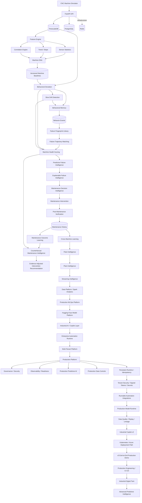

::: {align="center"}
``{=html}

# RedPulse AI

### Behavioral Intelligence & Predictive Maintenance Platform

**Behavior. Insight. Uptime.**
:::

[](https://github.com/saeidkh96/redpulse-ai/releases/tag/v3.3.0)
[](https://www.python.org/)
[](https://fastapi.tiangolo.com/)
[](https://www.timescale.com/)
[](https://www.postgresql.org/)
[](https://www.docker.com/)

------------------------------------------------------------------------

## What is RedPulse AI?

**RedPulse AI** is a production-oriented behavioral intelligence and
predictive-maintenance platform designed to learn how individual
industrial machines normally behave, detect when that behavior changes,
estimate failure risk, recommend maintenance, verify intervention
outcomes, and compare possible maintenance decisions.

Instead of treating every machine as identical, RedPulse builds a
**machine-specific behavioral fingerprint --- Machine DNA** --- from
multivariate telemetry. That baseline captures sensor statistics,
trends, and relationships between signals so future behavior can be
compared against what is normal for that specific machine.

RedPulse has evolved beyond threshold monitoring into an end-to-end
predictive-maintenance intelligence pipeline:

-   machine-specific behavioral baselines;
-   multivariate behavioral deviation detection;
-   slow-drift analysis;
-   persistent behavioral memory;
-   historical failure fingerprint storage;
-   failure-trajectory matching;
-   machine health scoring;
-   predictive failure intelligence;
-   explainable failure evidence and root-cause hints;
-   maintenance decision intelligence;
-   post-maintenance verification;
-   maintenance intervention history;
-   maintenance outcome learning;
-   counterfactual maintenance analysis.

> **Current milestone --- v3.3.0:** RedPulse extends the v3.2 Databricks
> Lakehouse foundation with a unified enterprise data-governance layer:
> structured governance policies, catalog/schema/table resource
> modeling, lineage-aware governance metadata, access-control policy
> foundations, and environment-aware Databricks deployment targets. The
> release keeps the existing Machine DNA, predictive-maintenance,
> Digital Twin, MLOps, streaming, automation, and production-engineering
> layers intact while strengthening the governance boundary around
> enterprise data workloads.

------------------------------------------------------------------------

## Why Machine DNA?

Traditional monitoring often asks:

> "Did a sensor cross a fixed threshold?"

RedPulse is built to ask a richer question:

> **"Is this machine behaving differently from its own learned normal
> behavior?"**

Two machines of the same model may operate under different loads,
environments, ages, maintenance histories, and sensor characteristics. A
single global threshold can miss that context.

Machine DNA provides a per-machine baseline containing:

-   sensor distributions and operating ranges;
-   mean, median, standard deviation, minimum, and maximum;
-   temporal trend/slope information;
-   multivariate sensor correlations;
-   baseline observation window and sample count;
-   persistent, automatically versioned baseline history.

Machine DNA is the foundation for later reasoning: deviation, drift,
failure matching, health scoring, prediction, maintenance verification,
and counterfactual analysis all depend on understanding what is normal
for the machine itself.

------------------------------------------------------------------------

## Current Intelligence Architecture



------------------------------------------------------------------------

## Current Capabilities --- v3.3.0

  ------------------------------------------------------------------------------
  Area                Capability                             Status
  ------------------- ------------------------- --------------------------------
  Platform            FastAPI backend                          ✅
                      foundation                

  Infrastructure      PostgreSQL / TimescaleDB                 ✅

  Infrastructure      Redis service                            ✅

  Data Model          Machine registry                         ✅

  Telemetry           Single and batch                         ✅
                      measurement ingestion     

  Telemetry           Machine / sensor /                       ✅
                      time-window queries       

  Telemetry           TimescaleDB hypertable                   ✅

  Simulation          Reproducible CNC                         ✅
                      telemetry generator       

  Simulation          RPM, load, temperature,                  ✅
                      current, vibration        

  Simulation          Normal, moderate, and                    ✅
                      severe degradation        
                      profiles                  

  Features            Statistical sensor                       ✅
                      features                  

  Features            Trend / slope extraction                 ✅

  Features            Cross-sensor correlation                 ✅
                      fingerprint               

  Machine DNA         Baseline generation and                  ✅
                      persistence               

  Machine DNA         Automatic baseline                       ✅
                      versioning                

  Behavioral          Behavioral deviation                     ✅
  Intelligence        scoring                   

  Behavioral          Per-sensor deviation                     ✅
  Intelligence        evidence                  

  Behavioral          Correlation-shift                        ✅
  Intelligence        detection                 

  Behavioral          Severity classification                  ✅
  Intelligence                                  

  Behavioral          Multi-window slow-drift                  ✅
  Intelligence        analysis                  

  Behavioral          Trend, persistence,                      ✅
  Intelligence        monotonicity,             
                      cumulative-change signals 

  Memory              Persistent behavioral                    ✅
                      event history             

  Memory              Deviation and drift event                ✅
                      recording                 

  Failure             Historical failure                       ✅
  Intelligence        fingerprint library       

  Failure             Failure trajectory                       ✅
  Intelligence        matching                  

  Health              Machine health scoring                   ✅

  Prediction          Predictive failure                       ✅
                      intelligence              

  Explainability      Evidence and root-cause                  ✅
                      hints                     

  Maintenance         Maintenance decision                     ✅
                      intelligence              

  Maintenance         Post-maintenance                         ✅
                      verification              

  Maintenance         Intervention history and                 ✅
                      lifecycle tracking        

  Maintenance         Before / after snapshots                 ✅

  Maintenance         Verification result                      ✅
                      persistence               

  Learning            Maintenance outcome                      ✅
                      learning                  

  Learning            Historical success rate                  ✅
                      and confidence            

  Counterfactual      No-maintenance trajectory                ✅
                      estimation                

  Counterfactual      Candidate intervention                   ✅
                      comparison                

  Counterfactual      Avoided risk / health                    ✅
                      loss / drift estimation   

  Counterfactual      Evidence-adjusted                        ✅
                      intervention ranking      

  Counterfactual      Historical support and                   ✅
                      confidence                

  Fleet Intelligence  Cross-machine learning                   ✅

  Fleet Intelligence  Fleet health / risk /                    ✅
                      prioritization            

  Fleet Intelligence  Machine similarity and                   ✅
                      peer grouping             

  Fleet Intelligence  Failure hotspots                         ✅

  Plant Intelligence  Site-level intelligence                  ✅

  Plant Intelligence  Fleet early warning                      ✅

  Plant Intelligence  Fleet risk forecasting                   ✅

  Plant Intelligence  Plant maintenance                        ✅
                      planning                  

  Streaming           In-memory event bus                      ✅
                      foundation                

  Streaming           Kafka event-bus adapter                  ✅

  Streaming           Intelligence event                       ✅
                      publishing                

  Streaming           Real-time window                         ✅
                      processing                

  Data Platform       Data-platform                            ✅
                      orchestration             

  Analytics           Spark analytics jobs                     ✅

  MLOps               Experiment tracking                      ✅

  MLOps               Model registry and                       ✅
                      version lifecycle         

  MLOps               Feature-store foundation                 ✅

  MLOps               Model/data monitoring                    ✅

  MLOps               Automated retraining                     ✅
                      control                   

  MLOps               Champion / challenger                    ✅
                      evaluation                

  MLOps               Model serving abstraction                ✅

  MLOps               MLflow adapter                           ✅

  MLOps               Airflow retraining                       ✅
                      adapter / DAG             

  Hugging Face        Hub adapter and model                    ✅
                      inspection                

  Hugging Face        Model metadata /                         ✅
                      model-card                
                      synchronization           

  Hugging Face        Local model cache                        ✅

  Hugging Face        Embedding adapter                        ✅

  Hugging Face        PEFT / LoRA training                     ✅
                      adapter                   

  Hugging Face        Inference adapter                        ✅

  Hugging Face        Provider-independent                     ✅
                      model gateway             

  Hugging Face        Unified model platform                   ✅
                      API                       

  Industrial AI       Knowledge ingestion                      ✅
                      foundation                

  Industrial AI       Structured knowledge                     ✅
                      store                     

  Industrial AI       Evidence-grounded                        ✅
                      engineer copilot          

  Industrial AI       Machine-context                          ✅
                      construction              

  Agentic AI          Tool registry and agent                  ✅
                      runtime                   

  Agentic AI          Maintenance planner                      ✅
                      foundation                

  Enterprise          RBAC foundation                          ✅

  Enterprise          Resilience controls                      ✅

  Enterprise          Observability hooks                      ✅

  Integrations        Vendor-independent                       ✅
                      Integration Gateway       

  Integrations        Adapter abstraction for                  ✅
                      enterprise automation     

  API                 Industrial Intelligence                  ✅
                      API surface               

  Automation          Enterprise automation                    ✅
                      control plane             

  Automation          n8n adapter foundation                   ✅

  Automation          Microsoft Power Automate                 ✅
                      adapter foundation        

  Automation          Generic webhook support                  ✅

  Automation          Retry / reliability                      ✅
                      foundations               

  Multi-Tenancy       Tenant registry and                      ✅
                      tenant users              

  Multi-Tenancy       Tenant RBAC                              ✅

  Multi-Tenancy       Tenant API-key foundation                ✅

  Multi-Tenancy       Tenant-scoped                            ✅
                      integrations              

  Multi-Tenancy       Tenant audit trail                       ✅

  Production Runtime  Automation job lifecycle                 ✅

  Production Runtime  Approval workflow                        ✅
                      foundation                

  Production Runtime  HTTP workflow executor                   ✅

  Production Runtime  Dead-letter / retry                      ✅
                      foundations               

  Production AI       Model serving router                     ✅

  Production AI       Drift-triggered                          ✅
                      retraining policy         

  Production AI       Champion / challenger                    ✅
                      evaluation                

  Production AI       Feature contracts and                    ✅
                      prediction envelopes      

  Production AI       Failure-risk model                       ✅
                      foundation                

  Production AI       Remaining-useful-life                    ✅
                      model foundation          

  Production Data     Telemetry repository                     ✅
                      contract                  

  Production Data     Dataset catalog                          ✅

  Production Data     Data-quality validation                  ✅

  Production Data     Lineage foundation                       ✅

  Production Data     Replay-plan model                        ✅

  Production Data     Spark job specification                  ✅

  Production Data     Fleet work partitioning                  ✅

  Production Platform Production control plane                 ✅

  Production Platform Readiness reporting                      ✅

  Production Platform Governance / security /                  ✅
                      persistence /             
                      observability foundations 

  API                 Enterprise Automation API                ✅
                      surface                   

  API                 Production Platform API                  ✅
                      surface                   

  v3 Runtime          Persistent local runtime                 ✅
                      repository                

  v3 Runtime          Restart-safe job records                 ✅

  v3 Runtime          Stable idempotency keys                  ✅

  v3 Runtime          Retry / dead-state job                   ✅
                      execution                 

  v3 Security         Signed token reference                   ✅
                      implementation            

  v3 Security         Tenant-aware                             ✅
                      authorization policy      

  v3 Security         Environment-backed secret                ✅
                      provider                  

  v3 Integrations     Runnable n8n webhook                     ✅
                      adapter                   

  v3 Integrations     Runnable Power Automate                  ✅
                      webhook adapter           

  v3 Integrations     Notification routing                     ✅
                      abstraction               

  v3 Reliability      Metrics registry and                     ✅
                      timing                    

  v3 Reliability      Circuit-breaker                          ✅
                      foundation                

  v3 ML Runtime       Production model router                  ✅

  v3 ML Runtime       Active model selection                   ✅

  v3 ML Runtime       Drift assessment and                     ✅
                      retraining coordinator    

  v3 ML Runtime       Failure-risk reference                   ✅
                      model                     

  v3 ML Runtime       Remaining-useful-life                    ✅
                      reference model           

  v3 Data Runtime     Replay buffer                            ✅

  v3 Data Runtime     Data-quality gate                        ✅

  v3 Data Runtime     Lineage registry                         ✅

  v3 Copilot          Citation model / evidence                ✅
                      formatting                

  v3 Copilot          Industrial Copilot v2                    ✅
                      orchestration foundation  

  v3 Deployment       Deployment readiness                     ✅
                      checks                    

  v3 Deployment       Kubernetes                               ✅
                      deployment/service        
                      manifest                  

  v3 Deployment       Azure/Terraform                          ✅
                      deployment scaffold       

  v3 Demo             End-to-end production                    ✅
                      demonstration service     

  API                 v3 readiness and demo                    ✅
                      endpoints                 

  Production          GitHub Actions CI                        ✅
  Engineering         workflow                  

  Production          TimescaleDB + Redis CI                   ✅
  Engineering         services                  

  Production          Alembic migration                        ✅
  Engineering         validation in CI          

  Production          Docker backend image                     ✅
  Engineering         validation                

  Production          CodeQL security scanning                 ✅
  Engineering                                   

  Production          Release validation                       ✅
  Engineering         workflow                  

  Digital Twin        Machine-state                            ✅
                      representation            

  Digital Twin        What-if scenario                         ✅
                      simulation                

  Digital Twin        Projected health / drift                 ✅
                      / failure-risk evaluation 

  Advanced Predictive Prediction uncertainty                   ✅
                      foundation                

  Advanced Predictive Multimodal evidence                      ✅
                      fusion foundation         

  Advanced Predictive Probabilistic RUL                        ✅
                      foundation                

  Advanced Predictive Counterfactual-analysis                  ✅
                      reference layer           

  Advanced Predictive Time-series                              ✅
                      foundation-model gateway  
                      abstraction               

  Data Governance     Unified governance policy                ✅
                      foundation                

  Data Governance     Catalog / schema / table                 ✅
                      resource modeling         

  Data Governance     Lineage-aware governance                 ✅
                      metadata                  

  Data Governance     Access-control policy                    ✅
                      foundation                

  Databricks          Environment-aware                        ✅
                      deployment targets        
  ------------------------------------------------------------------------------

------------------------------------------------------------------------

## End-to-End Intelligence Flow

``` text
Machine Telemetry
      ↓
Machine DNA
      ↓
Behavioral Deviation
      ↓
Slow Drift Detection
      ↓
Behavioral Memory
      ↓
Failure Fingerprint Library
      ↓
Failure Trajectory Matching
      ↓
Machine Health Scoring
      ↓
Failure Prediction
      ↓
Explainability / Root-Cause Hints
      ↓
Maintenance Recommendation
      ↓
Maintenance Intervention
      ↓
Post-Maintenance Verification
      ↓
Maintenance History
      ↓
Maintenance Outcome Learning
      ↓
Counterfactual Maintenance Intelligence
      ↓
Evidence-Adjusted Intervention Recommendation
```

------------------------------------------------------------------------

## Counterfactual Maintenance Intelligence

`v0.5.0` adds a new reasoning layer on top of the maintenance history
and outcome-learning pipeline.

RedPulse now evaluates:

> **What is the estimated trajectory if no maintenance is performed?**

and:

> **Which historically supported intervention is expected to produce the
> strongest outcome?**

The counterfactual engine compares the current machine condition with:

``` text
Current Machine State
        │
        ├── No Maintenance
        │      ↓
        │   Estimated Degradation
        │
        ├── Candidate Intervention A
        │      ↓
        │   Expected Outcome
        │
        ├── Candidate Intervention B
        │      ↓
        │   Expected Outcome
        │
        └── Candidate Intervention N
               ↓
            Expected Outcome
                  ↓
        Evidence-Adjusted Ranking
```

Representative outputs include:

``` text
predicted_health_score
predicted_risk_score
predicted_deviation_score
predicted_drift_score
predicted_failure_match_score

expected_recovery_score

avoided_risk
avoided_health_loss
avoided_drift

estimated_intervention_benefit
confidence
historical_support
evidence_scope
recommended_intervention
```

Counterfactual results are explicitly treated as **estimated projections
rather than guaranteed future states**.

Machine-type-specific intervention history is preferred when available.
If the platform must fall back to global maintenance history,
recommendation confidence is reduced.

------------------------------------------------------------------------

## Fleet, Plant & Streaming Intelligence --- v1.0.0

RedPulse v1.0.0 expands the intelligence scope beyond an individual
machine. Historical machine behavior and maintenance evidence can now
contribute to cross-machine reasoning, fleet-level health analysis,
failure-hotspot detection, and maintenance prioritization.

At plant level, the platform adds site summaries, fleet early-warning
signals, fleet risk forecasting, and plant maintenance planning. This
allows machine-level evidence to be aggregated into operational views
without removing the machine-specific context established by Machine
DNA.

The data platform adds an event-driven foundation for higher telemetry
volumes. It includes an in-memory event bus for local/test operation, an
optional Kafka adapter, intelligence-event publishing, real-time window
processing, and Spark analytics jobs. The unified data-platform API
exposes event publication, recent-event retrieval, and analytics
execution.

Representative v1.0.0 endpoints include:

``` text
GET/POST  /api/v1/machines/{machine_id}/cross-machine-learning
GET       /api/v1/fleet/peer-groups
GET       /api/v1/fleet/health
GET       /api/v1/fleet/failure-hotspots
GET       /api/v1/fleet/maintenance-priorities
GET       /api/v1/plant/sites/summary
GET       /api/v1/plant/fleet-early-warning
GET       /api/v1/plant/fleet-risk-forecast
GET       /api/v1/plant/maintenance-plan
POST      /api/v1/data-platform/events/publish
GET       /api/v1/data-platform/events/recent
POST      /api/v1/data-platform/analytics/run
```

The streaming stack is intentionally optional: the core
predictive-maintenance intelligence remains usable without Kafka or
Spark.

------------------------------------------------------------------------

## Production MLOps Platform --- v1.2.0

RedPulse v1.2.0 adds a production-oriented MLOps control plane around
the predictive-maintenance intelligence stack.

The platform includes experiment tracking, model registration and
lifecycle management, feature-store foundations, model/data monitoring,
automated retraining controls, champion/challenger evaluation, model
serving abstractions, observability hooks, and adapters for MLflow and
Airflow.

The MLOps layer is designed to keep model operations separate from the
core machine-intelligence logic, so predictive-maintenance services can
evolve without becoming tightly coupled to a single MLOps vendor.

Representative areas include:

``` text
Experiments
Model Registry
Model Lifecycle
Feature Store
Monitoring
Retraining
Champion / Challenger
Serving
MLflow Adapter
Airflow Adapter
Observability
MLOps Control Plane
```

------------------------------------------------------------------------

## Hugging Face Integration Platform --- v1.3.0

RedPulse v1.3.0 introduces a dedicated Hugging Face integration layer
for model discovery and future industrial-AI workloads.

The integration provides:

-   Hugging Face Hub model inspection;
-   model metadata and model-card synchronization;
-   local model caching;
-   embedding-model abstraction;
-   inference-model abstraction;
-   PEFT / LoRA training configuration;
-   a provider-independent model gateway;
-   a unified Hugging Face model platform and API.

Representative endpoints:

``` text
POST  /api/v1/huggingface/models/inspect
POST  /api/v1/huggingface/models/pull
POST  /api/v1/huggingface/generate
```

The predictive-maintenance core remains independent of Hugging Face. The
integration is an optional AI/model layer that can support later RAG,
industrial copilots, local models, fine-tuning, and domain-specific
inference.

------------------------------------------------------------------------

## Industrial Intelligence Platform --- v1.4.0

RedPulse v1.4.0 adds the first Industrial Intelligence layer on top of
the predictive-maintenance, data-platform, MLOps, and model-platform
foundations.

The release introduces:

-   knowledge ingestion for industrial and maintenance context;
-   structured knowledge models and an internal knowledge store;
-   evidence-grounded engineer-copilot services;
-   machine-context construction for contextual reasoning;
-   an agentic runtime with tool registration and execution;
-   a maintenance-planning agent foundation;
-   enterprise RBAC, resilience, and observability foundations;
-   a vendor-independent Integration Gateway and adapter abstraction.

Representative endpoints include:

``` text
POST  /api/v1/industrial-ai/knowledge/ingest
POST  /api/v1/industrial-ai/copilot/ask
POST  /api/v1/industrial-ai/agents/runs
```

The Industrial Intelligence layer is intentionally separated from the
predictive-maintenance core. LLM- or agent-based reasoning can therefore
consume machine evidence without replacing the deterministic behavioral,
failure, health, and maintenance intelligence pipeline.

The integration gateway establishes a common boundary for future
automation systems such as n8n, Microsoft Power Automate, generic
webhooks, and enterprise workflow tools. Individual external adapters
can evolve independently from RedPulse core intelligence.

------------------------------------------------------------------------

## Enterprise Automation & Multi-Tenant Platform --- v1.6.0

RedPulse v1.6.0 extends the Integration Gateway into an executable
enterprise-automation foundation and introduces tenant-aware platform
controls.

The release includes:

-   enterprise automation control-plane primitives;
-   n8n and Microsoft Power Automate adapter foundations;
-   generic webhook dispatch;
-   retry and reliability primitives;
-   tenant and tenant-user management;
-   tenant RBAC;
-   tenant API-key foundations;
-   tenant-scoped integration registration;
-   tenant audit records;
-   Enterprise Automation service and API endpoints.

Representative endpoints:

``` text
POST  /api/v1/enterprise-automation/tenants
POST  /api/v1/enterprise-automation/tenants/{tenant_id}/users
POST  /api/v1/enterprise-automation/integrations
GET   /api/v1/enterprise-automation/tenants/{tenant_id}/integrations
POST  /api/v1/enterprise-automation/dispatch
GET   /api/v1/enterprise-automation/tenants/{tenant_id}/audit
```

The adapters establish integration contracts and runtime foundations.
They do **not** imply that a live external n8n, Microsoft 365, Teams,
Outlook, Power Automate, Jira, CMMS, or ERP environment is currently
connected.

------------------------------------------------------------------------

## Production Industrial Intelligence Platform --- v2.0.0

RedPulse v2.0.0 adds a production-oriented platform layer on top of the
predictive-maintenance, MLOps, Industrial AI, automation, and
multi-tenant foundations.

### Production Automation Runtime

The runtime adds:

-   automation job lifecycle management;
-   approval requests and approval decisions;
-   HTTP workflow execution;
-   retry handling;
-   dead-letter foundations;
-   tenant-aware execution context.

### Production Predictive AI

The production AI layer adds:

-   model registration and champion routing;
-   drift-signal evaluation;
-   retraining policy decisions;
-   champion/challenger comparison;
-   feature-contract validation;
-   prediction envelopes with evidence;
-   failure-risk model foundations;
-   remaining-useful-life model foundations.

### Production Data Controls

The production data layer adds:

-   telemetry repository contracts;
-   dataset registration and cataloging;
-   data-quality validation;
-   lineage records;
-   replay-plan contracts;
-   Spark job specifications;
-   fleet work partitioning.

### Production Control Plane

The control plane consolidates production-readiness checks and
platform-level foundations for governance, security, persistence, and
observability.

Representative endpoints:

``` text
GET   /api/v1/production-platform/readiness
POST  /api/v1/production-platform/approvals
POST  /api/v1/production-platform/approvals/{approval_id}/decision
POST  /api/v1/production-platform/jobs
POST  /api/v1/production-platform/ml/drift/evaluate
POST  /api/v1/production-platform/data/quality
POST  /api/v1/production-platform/fleet/partitions
```

> **Scope note:** v2.0.0 is a **production-oriented engineering
> milestone**. RedPulse remains an experimental engineering/research
> project and is not presented as a production safety system or as a
> platform already deployed in a real industrial plant.

------------------------------------------------------------------------

## Production Demonstration Platform --- v3.0.0

RedPulse v3.0.0 focuses on production maturity and demonstrability
rather than adding another isolated intelligence layer.

### Persistent Runtime & Idempotency

The v3 runtime adds:

-   persistent local runtime records through a restart-safe JSON
    repository reference implementation;
-   stable idempotency-key generation;
-   job submission and execution lifecycle;
-   retry handling and terminal dead-state behavior.

The local JSON repository is a reference persistence implementation. It
does not replace the existing PostgreSQL/TimescaleDB infrastructure or
imply that all runtime state has already been migrated to a production
relational repository.

### Identity, Tenant Security & Secrets

The v3 security layer adds:

-   a signed-token reference implementation;
-   tenant-aware authorization context and policy evaluation;
-   environment-backed secret resolution.

The signed-token helper is intentionally lightweight and is **not**
presented as a replacement for a production OAuth2/OIDC/Entra ID
integration.

### Runnable Enterprise Integration Layer

RedPulse now includes HTTP-based runtime adapters for:

-   n8n webhook workflows;
-   Microsoft Power Automate flow endpoints;
-   generic JSON webhook invocation;
-   notification routing.

These adapters can perform real HTTP calls when valid external endpoints
and credentials are configured. The repository does not claim that a
live external enterprise environment is bundled or currently connected.

### Production ML Runtime

The v3 model runtime includes:

-   model registration and activation;
-   production model routing;
-   drift assessment;
-   retraining coordination;
-   failure-risk reference prediction;
-   remaining-useful-life reference prediction.

These reference models demonstrate serving and orchestration contracts.
They are not presented as plant-certified or production-trained
industrial models.

### Industrial Data Runtime

The data-runtime layer adds:

-   replayable pipeline events;
-   data-quality gates;
-   lineage registry records.

These components complement the existing Kafka, Spark, Airflow,
TimescaleDB, and MLOps foundations.

### Industrial Copilot v2

Industrial Copilot v2 adds:

-   citation structures;
-   evidence packaging;
-   retriever-driven context assembly;
-   optional generator integration.

If no approved generator is connected, the orchestrator returns prepared
evidence instead of pretending that an LLM answer was generated.

### Deployment Path

v3.0.0 introduces:

-   Kubernetes Deployment and Service manifests;
-   readiness probing;
-   an Azure/Terraform scaffold.

These are deployment paths and scaffolds, not evidence of a live Azure
or AKS deployment.

### End-to-End Production Demonstration

The v3 demonstration service connects machine signals to
production-oriented decision output:

``` text
Machine Signals
      ↓
Failure-Risk Reference Model
      ↓
Remaining-Useful-Life Reference Model
      ↓
Maintenance Recommendation
      ↓
Persistent Runtime Record
      ↓
Approval Requirement
```

Representative endpoints:

``` text
GET   /api/v1/v3/readiness
POST  /api/v1/v3/demo/run
```

> **Scope note:** v3.0.0 is a production-demonstration engineering
> release. It validates architecture, runtime contracts, APIs, and
> deployment paths, but it is not a claim of real-plant production
> deployment or safety certification.

------------------------------------------------------------------------

## Production Engineering, Digital Twin & Advanced Predictive Intelligence --- v3.1.0

RedPulse v3.1.0 adds three cross-cutting engineering layers on top of
the v3 production demonstration platform.

### Production Engineering & CI/CD

The repository now includes GitHub Actions workflows for continuous
integration, Docker validation, security scanning, and release
validation.

The CI environment validates the backend against infrastructure
dependencies that mirror the development stack:

-   Python 3.12;
-   TimescaleDB / PostgreSQL;
-   Redis;
-   Alembic migrations;
-   full backend and simulator test suites;
-   Docker backend image builds;
-   CodeQL security analysis;
-   non-blocking Ruff quality reporting.

The v3.3.0 milestone validates **238 automated tests**.

### Industrial Digital Twin Foundations

The Digital Twin layer introduces software abstractions for representing
machine state and evaluating controlled what-if scenarios.

Current foundations include:

-   machine-state representation;
-   telemetry-driven state updates;
-   scenario simulation;
-   projected health estimation;
-   projected drift estimation;
-   projected failure-risk evaluation;
-   fleet-level twin aggregation and risk ranking.

These components are engineering/reference foundations for future
physics-informed or plant-integrated digital twins. They are not
presented as certified physical twins of real industrial assets.

### Advanced Predictive Intelligence

The advanced predictive layer introduces additional decision-support
foundations for uncertainty-aware and scenario-aware prediction.

Current foundations include:

-   predictive uncertainty estimation;
-   multimodal evidence fusion;
-   probabilistic Remaining Useful Life estimation;
-   counterfactual maintenance-analysis references;
-   time-series foundation-model gateway abstractions.

These capabilities extend the existing Machine DNA,
behavioral-deviation, drift, failure-intelligence, health, and
maintenance reasoning pipeline. They are reference implementations and
software contracts rather than claims of validated plant-specific
predictive models.

### Representative v3.1 API

``` text
POST  /api/v1/v31/digital-twin/simulate
POST  /api/v1/v31/advanced-predictive/evaluate
GET   /api/v1/v31/production-engineering/readiness
```

> **Scope note:** v3.1.0 strengthens production engineering and
> introduces Digital Twin and advanced predictive-intelligence
> foundations. RedPulse remains an experimental engineering/research
> platform and is not presented as a safety-certified industrial control
> or maintenance system.

------------------------------------------------------------------------

## Maintenance Outcome Learning

Maintenance interventions are stored as persistent entities instead of
temporary events.

A maintenance record can include:

``` text
Machine
Failure Prediction Context
Maintenance Recommendation
Intervention Type
Lifecycle Status
Technician Notes
Before Snapshot
After Snapshot
Verification Result
Outcome Classification
Outcome Evidence
Start / Completion Time
```

Completed maintenance history is aggregated by intervention type.

Example:

``` text
Bearing Replacement
      ↓
Average Recovery Score
Average Risk Reduction
Average Drift Reduction
Average Health Improvement
Success Rate
Historical Support
Confidence
      ↓
Learned Intervention Profile
```

This learned evidence becomes the input for counterfactual intervention
comparison.

------------------------------------------------------------------------

## Post-Maintenance Verification

RedPulse does not stop after recommending maintenance.

After an intervention, the platform can compare the machine's current
behavior against the pre-maintenance snapshot and determine whether the
intervention produced measurable recovery.

Verification considers signals such as:

``` text
Health Improvement
Risk Reduction
Deviation Reduction
Drift Reduction
Failure-Match Reduction
```

The result is persisted in the maintenance history so later versions can
learn which actions work under which machine conditions.

------------------------------------------------------------------------

## Failure Intelligence

RedPulse maintains reusable historical failure knowledge.

### Failure Fingerprints

Historical degradation patterns can be stored as structured failure
fingerprints containing behavioral and trajectory evidence.

### Failure Trajectory Matching

Current machine behavior can be compared against known historical
failure trajectories to estimate whether the machine is evolving toward
a previously observed failure pattern.

### Predictive Failure Intelligence

Trajectory evidence, machine health, deviation, drift, and historical
failure similarity are combined into predictive failure signals.

### Explainability

Predictions are accompanied by evidence so maintenance decisions are not
based on an opaque score alone.

------------------------------------------------------------------------

## Machine DNA Example

A Machine DNA baseline is generated from synchronized telemetry and
persisted for later comparison.

``` json
{
  "baseline_version": "1",
  "sample_count": 1010,
  "sensor_features": {
    "vibration": {
      "mean": 2.1508,
      "std": 0.0832,
      "median": 2.149,
      "minimum": 1.875,
      "maximum": 2.382
    },
    "temperature": {
      "mean": 64.157,
      "std": 1.2313
    }
  },
  "correlations": {
    "current__load": 0.8667,
    "load__temperature": 0.8225,
    "rpm__vibration": 0.3433
  }
}
```

The baseline is not just a collection of independent thresholds. The
correlations preserve part of the **relationship structure** between
machine signals.

------------------------------------------------------------------------

## CNC Telemetry Simulator

RedPulse includes a deterministic CNC simulator for development and
validation.

It currently generates five signals:

``` text
rpm
load
temperature
current
vibration
```

The signals are intentionally related. For example, load influences
temperature and current, while RPM contributes to vibration.

Seeded generation makes experiments reproducible. The simulator also
supports normal, moderate-degradation, and severe-degradation profiles
so the intelligence pipeline can be validated against controlled
deterioration scenarios.

------------------------------------------------------------------------

## Behavioral Intelligence Example

With degradation telemetry, RedPulse can distinguish healthy operation
from meaningful behavioral change.

A behavioral-memory event can preserve evidence such as:

``` json
{
  "event_type": "drift",
  "severity": "anomalous",
  "score": 0.60999,
  "baseline_version": "3",
  "summary": "Slow behavioral drift detected with score 0.610 and state drifting",
  "evidence": {
    "state": "drifting",
    "top_signals": [
      {
        "signal": "vibration__mean_zscore",
        "score": 0.86,
        "state": "drifting"
      },
      {
        "signal": "overall_deviation",
        "score": 0.72,
        "state": "drifting"
      },
      {
        "signal": "current__mean_zscore",
        "score": 0.66,
        "state": "drifting"
      }
    ]
  }
}
```

Behavioral Memory converts individual analyses into structured
historical evidence used by failure intelligence and maintenance
reasoning.

------------------------------------------------------------------------

## Technology Stack

### Backend

-   Python
-   FastAPI
-   Pydantic
-   SQLAlchemy
-   Alembic
-   asyncpg

### Data & Infrastructure

-   PostgreSQL 17
-   TimescaleDB
-   Redis
-   Apache Kafka
-   Apache Spark
-   Apache Airflow
-   Databricks Lakehouse architecture
-   Medallion Architecture (Bronze / Silver / Gold)
-   Databricks Auto Loader foundation
-   Unity Catalog governance foundation
-   Databricks Asset Bundles
-   MLflow integration adapter
-   Docker / Docker Compose
-   Kubernetes deployment manifest
-   Terraform Azure scaffold

### Intelligence & Analytics

-   statistical feature extraction
-   multivariate behavioral fingerprints
-   correlation analysis
-   behavioral deviation scoring
-   multi-window drift analysis
-   failure trajectory matching
-   health scoring
-   evidence aggregation
-   maintenance outcome learning
-   counterfactual intervention comparison
-   cross-machine learning and machine similarity
-   fleet health, hotspots, and prioritization
-   plant-level risk and maintenance planning
-   real-time event/window processing
-   large-scale Spark analytics
-   experiment tracking and model lifecycle management
-   model monitoring and automated retraining
-   champion / challenger evaluation
-   Hugging Face Hub / model caching
-   embeddings and inference adapters
-   PEFT / LoRA integration
-   provider-independent model gateway
-   evidence-grounded industrial knowledge retrieval
-   engineer-copilot context construction
-   agentic tool execution and maintenance planning
-   enterprise RBAC / resilience / observability foundations
-   vendor-independent integration gateway
-   enterprise automation control plane
-   n8n / Power Automate adapter foundations
-   generic webhook workflows
-   tenant-aware RBAC and API-key foundations
-   production automation jobs and approvals
-   model serving / drift / retraining policies
-   champion / challenger evaluation
-   failure-risk and RUL model foundations
-   dataset catalog, data quality, lineage, replay, and partitioning
-   governance, persistence, security, observability, and readiness
    foundations
-   persistent runtime and idempotency foundations
-   signed-token and tenant authorization reference implementation
-   environment-based secret provider
-   runnable n8n / Power Automate webhook clients
-   metrics registry and circuit breaker
-   production model routing and retraining coordination
-   failure-risk and RUL reference models
-   replay, data-quality, and lineage runtime controls
-   Industrial Copilot v2 citation/evidence orchestration
-   Kubernetes deployment manifests
-   Azure / Terraform deployment scaffold
-   end-to-end v3 production demonstration service
-   industrial Digital Twin state/scenario foundations
-   uncertainty-aware and multimodal predictive-intelligence foundations
-   probabilistic RUL and time-series model-gateway abstractions

### Quality

-   pytest
-   unit tests
-   service-layer tests
-   API / OpenAPI tests
-   migration validation
-   reproducible simulator tests
-   GitHub Actions CI and release validation
-   TimescaleDB / Redis integration validation
-   Docker build validation
-   CodeQL security scanning

------------------------------------------------------------------------

## Repository Structure

``` text
redpulse-ai/
├── backend/
│   ├── alembic/
│   │   └── versions/
│   ├── app/
│   │   ├── api/v1/
│   │   ├── agents/
│   │   ├── automation/
│   │   ├── copilot/
│   │   ├── copilot_v3/
│   │   ├── core/
│   │   ├── deviation/
│   │   ├── drift/
│   │   ├── enterprise/
│   │   ├── explainability/
│   │   ├── failure/
│   │   ├── features/
│   │   ├── fleet/
│   │   ├── health/
│   │   ├── governance_v33/
│   │   ├── databricks_deploy_v34/
│   │   ├── integrations/
│   │   │   └── huggingface/
│   │   ├── integrations_gateway/
│   │   ├── integrations_v3/
│   │   ├── knowledge/
│   │   ├── maintenance/
│   │   ├── memory/
│   │   ├── ml_runtime_v3/
│   │   ├── mlops/
│   │   ├── models/
│   │   ├── plant/
│   │   ├── prediction/
│   │   ├── observability_v3/
│   │   ├── production/
│   │   ├── repositories/
│   │   ├── runtime_v3/
│   │   ├── schemas/
│   │   ├── security_v3/
│   │   ├── services/
│   │   ├── streaming/
│   │   ├── tenancy/
│   │   └── data_platform/
│   └── tests/
├── analytics/
│   └── spark/
├── orchestration/
│   └── airflow/
│       └── dags/
├── infra/
│   ├── k8s/
│   └── terraform/azure/
├── databricks/
│   ├── databricks.yml
│   ├── targets.yml
│   └── jobs/
│       ├── bronze_to_silver.py
│       └── silver_to_gold.py
├── simulator/
│   ├── profiles/
│   └── tests/
├── docs/
│   └── images/
├── docker-compose.yml
├── docker-compose.streaming.yml
├── backend/requirements-mlops.txt
├── backend/requirements-huggingface.txt
├── .env.example
└── README.md
```

------------------------------------------------------------------------

## Quick Start

### 1. Clone the repository

``` bash
git clone https://github.com/saeidkh96/redpulse-ai.git
cd redpulse-ai
```

### 2. Create and activate a virtual environment

Windows PowerShell:

``` powershell
python -m venv .venv
.\.venv\Scripts\Activate.ps1
```

### 3. Install backend dependencies

``` powershell
pip install -r backend\requirements.txt
```

### 4. Start TimescaleDB and Redis

``` powershell
docker compose up -d
docker ps
```

Development infrastructure:

``` text
TimescaleDB / PostgreSQL : localhost:5433
Redis                    : localhost:6379
```

### 5. Apply database migrations

``` powershell
cd backend
alembic upgrade head
```

### 6. Start the API

``` powershell
python -m uvicorn app.main:app --reload --port 8001
```

API root:

``` text
http://127.0.0.1:8001/
```

Interactive API documentation:

``` text
http://127.0.0.1:8001/docs
```

------------------------------------------------------------------------

## Core API Flow

``` text
Register Machine
      ↓
Ingest / Simulate Telemetry
      ↓
Build Machine DNA
      ↓
Analyze Behavioral Deviation
      ↓
Analyze Slow Drift
      ↓
Persist Behavioral Memory
      ↓
Build / Query Failure Intelligence
      ↓
Assess Machine Health
      ↓
Predict Failure Risk
      ↓
Explain Failure Evidence
      ↓
Generate Maintenance Recommendation
      ↓
Track Maintenance Intervention
      ↓
Verify Post-Maintenance Recovery
      ↓
Learn Maintenance Outcomes
      ↓
Analyze Counterfactual Maintenance Options
      ↓
Fleet / Plant Intelligence
      ↓
Streaming / Data Platform
      ↓
MLOps / Model Platform
      ↓
Industrial AI / Copilot
      ↓
Enterprise Automation / Multi-Tenancy
      ↓
Production Control Plane
      ↓
Persistent Runtime / Security
      ↓
Runnable Enterprise Integrations
      ↓
Production ML & Data Runtime
      ↓
Industrial Copilot v2
      ↓
Deployment Readiness
      ↓
v3 Production Demonstration
      ↓
Production Engineering / CI-CD
      ↓
Industrial Digital Twin
      ↓
Advanced Predictive Intelligence
      ↓
Databricks Lakehouse / Medallion Data Platform
      ↓
Unity Catalog Governance / Asset Bundles
      ↓
Unified Enterprise Data Governance
```

Representative endpoint groups include:

``` text
Machines
Telemetry
Machine DNA
Deviation
Drift
Behavioral Memory
Failure Fingerprints
Failure Matching
Machine Health
Failure Prediction
Failure Explanation
Maintenance Recommendation
Maintenance Verification
Maintenance Intervention History
Maintenance Outcome Learning
Counterfactual Maintenance
Fleet / Plant Intelligence
Data Platform
MLOps Platform
Hugging Face Platform
Industrial AI
Enterprise Automation
Production Platform
v3 Production Demo
v3.1 Production Engineering
v3.1 Digital Twin
v3.1 Advanced Predictive Intelligence
      ↓
Databricks Lakehouse / Medallion Data Platform
      ↓
Unity Catalog Governance / Asset Bundles
```

Representative maintenance endpoints include:

``` text
POST   /api/v1/machines/{machine_id}/maintenance-interventions
GET    /api/v1/machines/{machine_id}/maintenance-interventions
GET    /api/v1/maintenance-interventions/{intervention_id}
POST   /api/v1/maintenance-interventions/{intervention_id}/complete

GET    /api/v1/maintenance-outcomes

POST   /api/v1/machines/{machine_id}/counterfactual-maintenance
```

Use the interactive FastAPI documentation at `/docs` for the complete
current endpoint surface.

------------------------------------------------------------------------

## Testing

Run the backend and simulator test suites from the repository root:

``` powershell
python -m pytest backend\tests simulator\tests -q
```

At the `v3.3.0` milestone:

``` text
238 passed
```

The suite covers:

-   platform health and infrastructure;
-   machine registry;
-   telemetry ingestion and queries;
-   simulator behavior and degradation profiles;
-   feature extraction;
-   Machine DNA generation and versioning;
-   behavioral deviation scoring;
-   slow-drift detection;
-   Behavioral Memory;
-   failure fingerprints and trajectory matching;
-   machine health scoring;
-   predictive failure intelligence;
-   explainability;
-   maintenance decision intelligence;
-   post-maintenance verification;
-   maintenance history and outcome learning;
-   counterfactual maintenance intelligence;
-   service-layer behavior;
-   API / OpenAPI integration;
-   Hugging Face model-platform integration;
-   Industrial AI knowledge and copilot services;
-   agentic runtime and maintenance-planning foundations;
-   enterprise and integration-gateway foundations;
-   enterprise automation and multi-tenant platform controls;
-   n8n / Power Automate adapter foundations;
-   production automation runtime and approvals;
-   production predictive-AI operations;
-   production data-quality, lineage, replay, and partitioning
    foundations;
-   production control-plane and readiness APIs;
-   persistent runtime and idempotency;
-   signed-token and tenant policy foundations;
-   v3 production model runtime;
-   data replay, quality, and lineage controls;
-   v3 production demonstration service and API.

------------------------------------------------------------------------

## Milestones

``` text
v0.0.1  Platform Foundation
   ↓
v0.0.2  Data Infrastructure
   ↓
v0.0.3  Machine Registry
   ↓
v0.0.4  Telemetry Ingestion
   ↓
v0.0.5  CNC Simulator Baseline
   ↓
v0.1.0  Feature Engine + Machine DNA
   ↓
v0.1.1  Behavioral Deviation Engine
   ↓
v0.1.2  Slow Drift Detection
   ↓
v0.2.0  Behavioral Memory
   ↓
v0.2.1  Historical Failure Fingerprint Library
   ↓
v0.2.2  Failure Trajectory Matching
   ↓
v0.3.0  Machine Health Scoring
   ↓
v0.3.1  Predictive Failure Intelligence
   ↓
v0.3.2  Explainable Failure Intelligence
   ↓
v0.4.0  Maintenance Decision Intelligence
   ↓
v0.4.1  Post-Maintenance Verification
   ↓
v0.4.2  Maintenance History & Intervention Tracking
   ↓
v0.4.3  Maintenance Outcome Learning
   ↓
v0.5.0  Counterfactual Maintenance Intelligence
   ↓
v0.6.0  Cross-Machine Learning
   ↓
v0.7.0  Fleet Intelligence & Maintenance Prioritization
   ↓
v0.8.0  Plant Intelligence & Maintenance Planning
   ↓
v0.8.1  Streaming Foundation
   ↓
v0.8.2  Kafka Adapter
   ↓
v0.8.3  Intelligence Events
   ↓
v0.9.0  Real-Time Streaming
   ↓
v1.0.0  Streaming & Large-Scale Data Platform
   ↓
v1.2.0  Production MLOps Platform
   ↓
v1.3.0  Hugging Face Integration Platform
   ↓
v1.4.0  Industrial Intelligence Platform
   ↓
v1.6.0  Enterprise Automation & Multi-Tenant Platform
   ↓
v2.0.0  Production Industrial Intelligence Platform
   ↓
v2.1.0  Persistent Runtime & Idempotency
   ↓
v2.2.0  Identity, Tenant Security & Secrets
   ↓
v2.3.0  Runnable Enterprise Integration Layer
   ↓
v2.4.0  Observability & Reliability Foundations
   ↓
v2.5.0  Production Model Serving & Drift/Retraining
   ↓
v2.6.0  Industrial Data Runtime, Replay & Lineage
   ↓
v2.7.0  Industrial Copilot v2
   ↓
v2.8.0  Kubernetes Deployment Path
   ↓
v2.9.0  Azure / Terraform Deployment Scaffold
   ↓
v3.0.0  Production Demonstration Platform
   ↓
v3.1.0  Production Engineering, Digital Twin & Advanced Predictive Intelligence
   ↓
v3.2.0  Databricks Lakehouse & Enterprise Data Platform
   ↓
v3.3.0  Unified Data Governance   ← current
   ↓
v3.4.0  Databricks Deployment Automation
   ↓
v3.5.0  Streaming & Scale Expansion
   ↓
v3.6.0  Production Orchestration
   ↓
v3.7.0  Advanced MLOps
   ↓
v3.8.0  Enterprise Integration Expansion
   ↓
v3.9.0  Platform Hardening
   ↓
v4.0.0  Operational Validation Platform
```

------------------------------------------------------------------------

## Roadmap

The project is intentionally evolving in layers. New infrastructure is
added only when it has a concrete architectural use case.

### Completed in v1.0.0 --- Fleet, Plant & Streaming Data Platform

The v1.0.0 milestone completes the planned cross-machine, fleet, plant,
and initial distributed-data layers:

-   cross-machine learning and shared historical evidence;
-   machine similarity and peer grouping;
-   fleet health, failure hotspots, and maintenance prioritization;
-   plant/site intelligence, early warning, risk forecasting, and
    maintenance planning;
-   event-streaming foundation with an optional Kafka adapter;
-   real-time streaming windows and intelligence events;
-   Spark analytics jobs for telemetry, features, and fleet analytics;
-   data-platform orchestration and API endpoints.

### Completed in v1.2.0 --- Production MLOps

-   experiment tracking;
-   model registry and model lifecycle management;
-   feature-store foundation;
-   data and model monitoring;
-   automated retraining controls;
-   champion / challenger evaluation;
-   serving abstraction;
-   MLflow integration adapter;
-   Airflow retraining adapter and DAG;
-   MLOps observability and control-plane services.

Important production metrics continue to include false-alert rate,
precision / recall, early-warning lead time, and maintenance outcome
quality.

### Completed in v1.3.0 --- Hugging Face Integration Platform

The first model-platform layer is now implemented:

-   Hugging Face Hub adapter;
-   model metadata and model-card synchronization;
-   local model cache;
-   embeddings adapter;
-   inference adapter;
-   PEFT / LoRA adapter;
-   provider-independent model gateway;
-   unified Hugging Face model platform API.

### Completed in v1.4.0 --- Industrial Intelligence Platform

The first Industrial AI / Engineer Copilot layer is now implemented:

-   industrial knowledge ingestion and structured knowledge storage;
-   evidence-grounded copilot foundation;
-   machine-context construction;
-   agentic runtime and tool registry;
-   maintenance-planning agent foundation;
-   enterprise RBAC, resilience, and observability foundations;
-   vendor-independent Integration Gateway.

The predictive core remains independent of the LLM and agent layers.
More advanced model serving, domain adaptation, prompt evaluation, and
production-grade external automation remain future work.

### Completed in v1.6.0 --- Enterprise Automation & Multi-Tenancy

The enterprise automation layer now includes:

-   n8n adapter foundation;
-   Microsoft Power Automate adapter foundation;
-   generic webhooks;
-   automation dispatch and reliability primitives;
-   tenants and tenant users;
-   tenant RBAC and API-key foundations;
-   tenant-specific integrations;
-   tenant audit records.

### Completed in v2.0.0 --- Production Platform Foundation

The v2.0.0 milestone adds production-oriented operational building
blocks:

-   automation jobs, approvals, retries, and dead-letter foundations;
-   production predictive-AI model routing and retraining policy;
-   champion/challenger evaluation;
-   failure-risk and remaining-useful-life model foundations;
-   data-quality validation, dataset catalog, lineage, replay contracts,
    and fleet partitioning;
-   governance, persistence, security, and observability foundations;
-   production control-plane readiness reporting.

### Completed in v3.0.0 --- Production Demonstration Platform

The v3.0.0 milestone adds the next production-maturity layer:

-   persistent runtime reference implementation and idempotency keys;
-   tenant-aware signed-token and authorization foundations;
-   environment-backed secret resolution;
-   runnable HTTP adapters for n8n and Power Automate endpoints;
-   metrics and circuit-breaker primitives;
-   production model routing and retraining coordination;
-   failure-risk and RUL reference models;
-   replay, data-quality, and lineage runtime components;
-   Industrial Copilot v2 evidence/citation orchestration;
-   Kubernetes deployment/service manifests;
-   Azure/Terraform deployment scaffold;
-   end-to-end v3 readiness and demonstration APIs.

### Completed in v3.1.0 --- Production Engineering, Digital Twin & Advanced Predictive Intelligence

The v3.1.0 milestone adds:

-   GitHub Actions-based CI/CD validation;
-   TimescaleDB and Redis service dependencies in CI;
-   automated Alembic migration validation;
-   backend Docker image validation;
-   CodeQL security scanning;
-   release-validation workflow hardening;
-   machine-state and what-if Digital Twin foundations;
-   projected health, drift, and failure-risk simulation;
-   uncertainty-aware predictive foundations;
-   multimodal predictive-evidence fusion;
-   probabilistic Remaining Useful Life foundations;
-   counterfactual-analysis references;
-   time-series foundation-model gateway abstractions.

### Completed in v3.2.0 --- Databricks Lakehouse & Enterprise Data Platform

The v3.2.0 milestone adds:

-   Databricks-oriented Lakehouse architecture foundations;
-   Bronze / Silver / Gold Medallion processing boundaries;
-   Auto Loader-oriented ingestion foundations;
-   Unity Catalog governance abstractions;
-   Databricks Asset Bundle configuration;
-   Bronze-to-Silver and Silver-to-Gold job entry points;
-   GitHub Actions validation for Databricks bundle assets;
-   a dedicated v3.2 roadmap API;
-   validated foundations for the v3.3.0--v4.0.0 roadmap.

### Completed in v3.3.0 --- Unified Data Governance

The v3.3.0 milestone deepens the enterprise governance layer introduced
with the Databricks platform foundation:

-   unified governance-policy models for enterprise data resources;
-   catalog, schema, and table-level governance abstractions;
-   access-control policy foundations;
-   lineage-aware governance metadata;
-   governance rules designed to remain separate from core
    predictive-maintenance intelligence;
-   environment-aware Databricks deployment targets for controlled
    platform promotion;
-   dedicated governance validation tests integrated with the full
    project test suite.

The governance layer is an engineering foundation. It does **not** claim
a live enterprise Unity Catalog deployment, production identity-provider
integration, or a connected corporate Databricks workspace.

### Planned v3.4.0--v4.0.0

The next roadmap sequence focuses on turning the new foundations into
deeper operational capabilities:

-   **v3.4.0 --- Databricks Deployment Automation:** strengthen Asset
    Bundle deployment and environment promotion workflows.
-   **v3.5.0 --- Streaming & Scale Expansion:** deepen high-throughput
    streaming and distributed analytics.
-   **v3.6.0 --- Production Orchestration:** expand scheduled and
    event-driven pipeline orchestration.
-   **v3.7.0 --- Advanced MLOps:** deepen registry, monitoring,
    retraining, and champion/challenger workflows.
-   **v3.8.0 --- Enterprise Integration Expansion:** extend enterprise
    workflow and external-system adapters.
-   **v3.9.0 --- Platform Hardening:** strengthen security, resilience,
    observability, and deployment readiness.
-   **v4.0.0 --- Operational Validation Platform:** consolidate
    realistic end-to-end deployment, load, recovery, and operational
    validation.

### Next Phase --- Real Deployment & Operational Validation

Future work should now focus less on adding new modules and more on
validating the existing platform in realistic environments:

-   migrate reference/local runtime persistence to durable
    database-backed repositories;
-   production OAuth2 / OIDC / Entra ID integration;
-   secure secret storage such as Azure Key Vault;
-   live n8n and/or Power Automate end-to-end environments;
-   Prometheus / OpenTelemetry integration with dashboards and alerting;
-   load, recovery, failure-injection, and resilience testing;
-   deploy the API and supporting services to Kubernetes / AKS;
-   expand Terraform from scaffold to reproducible cloud infrastructure;
-   connect production model serving to trained industrial datasets and
    model registry;
-   evaluate early-warning quality, false-alert rate, precision/recall,
    lead time, and maintenance outcomes on realistic datasets.

RedPulse should continue to preserve separation between its core machine
intelligence and optional automation, LLM, MLOps, and cloud vendors.

------------------------------------------------------------------------

## Vision

RedPulse AI is being developed around seven core ideas:

1.  **Every machine has its own normal.**\
    Learn machine-specific behavior instead of relying only on universal
    thresholds.

2.  **Relationships matter.**\
    A machine can change even when individual sensor values still look
    acceptable.

3.  **Failures have trajectories.**\
    Historical degradation patterns can become reusable failure
    fingerprints.

4.  **Predictions need evidence.**\
    Maintenance recommendations should show which signals, trends, and
    relationships changed.

5.  **Maintenance should be verifiable.**\
    After intervention, the platform should determine whether the
    machine actually returned toward healthy behavior.

6.  **Maintenance history should become reusable knowledge.**\
    Intervention outcomes should improve future maintenance decisions.

7.  **Decisions should consider alternatives.**\
    The platform should estimate what may happen without intervention
    and compare historically supported maintenance options before
    recommending an action.

------------------------------------------------------------------------

## Development Status

RedPulse AI is under active development and is currently an
**experimental engineering/research project**, not a production safety
system.

The current `v3.3.0` release extends the maintenance-learning loop with
fleet/plant intelligence, streaming and large-scale analytics,
production-oriented MLOps, Hugging Face model integration, Industrial
Intelligence, enterprise automation, multi-tenancy, a
production-platform control plane, persistent runtime foundations,
production ML/data runtime components, deployment assets, an end-to-end
production demonstration service, production CI/CD validation,
industrial Digital Twin foundations, and advanced
predictive-intelligence components:

``` text
Machine Behavior
      ↓
Failure Intelligence
      ↓
Machine Health
      ↓
Failure Prediction
      ↓
Explainability
      ↓
Maintenance Decision
      ↓
Post-Maintenance Verification
      ↓
Maintenance History
      ↓
Outcome Learning
      ↓
Counterfactual Maintenance Intelligence
```

The next roadmap stage is **v3.4.0 --- Databricks Deployment
Automation**, followed by deeper streaming, orchestration, MLOps,
enterprise integration, platform hardening, and ultimately **v4.0.0 ---
Operational Validation Platform**. The broader major stage remains
**real deployment and operational validation**: durable database-backed
runtime state, production identity and secrets, live
external-integration environments, richer observability and SLOs,
load/recovery testing, Kubernetes/AKS deployment, reproducible cloud
infrastructure, and model validation on realistic industrial datasets.
The behavioral and predictive-maintenance core remains independent from
optional LLM, automation, MLOps, and cloud vendors.

------------------------------------------------------------------------

## Author

**Saeid Khalilian**

------------------------------------------------------------------------

## License

See the repository license for usage terms.

::: {align="center"}
`<strong>`{=html}RedPulse AI`</strong>`{=html}

`<em>`{=html}Behavior. Insight. Uptime.`</em>`{=html}
:::
