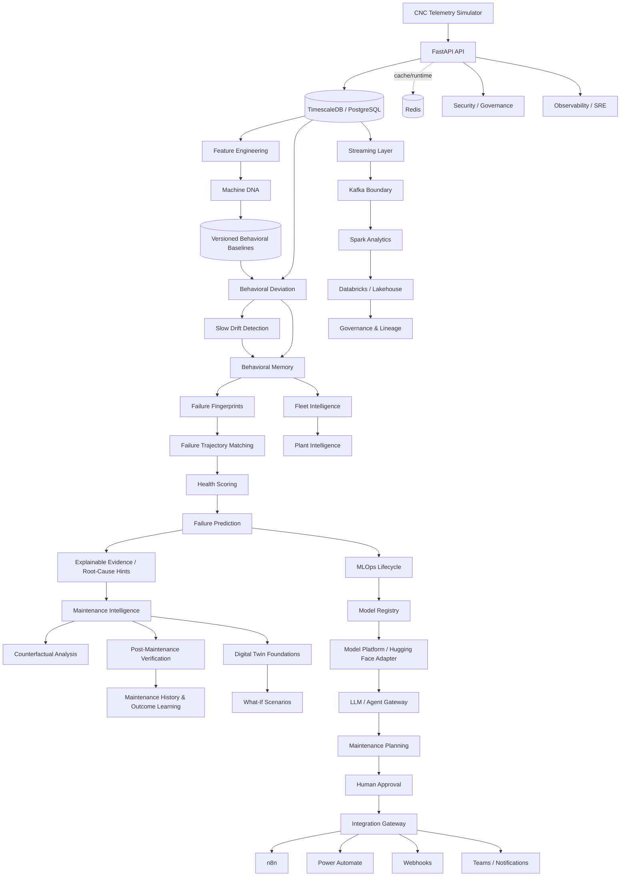

<div align="center">


[](https://github.com/saeidkh96/redpulse-ai/releases/tag/v4.0.0)
[](https://www.python.org/)
[](https://fastapi.tiangolo.com/)
[](https://www.postgresql.org/)
[](https://www.docker.com/)

</div>

---

## Overview

**RedPulse AI** is a production-oriented Behavioral Intelligence & Predictive Maintenance Platform for industrial machine intelligence.

It learns how individual machines normally behave, detects behavioral change and slow drift, estimates failure risk, produces explainable evidence, supports maintenance decisions, verifies intervention outcomes, and reuses historical evidence across machines and fleets.

Instead of treating every machine as identical, RedPulse builds a **machine-specific behavioral fingerprint — Machine DNA** from multivariate telemetry.

Versioned behavioral baselines provide the reference for:

- behavioral deviation detection;
- slow drift analysis;
- behavioral memory;
- historical failure fingerprinting;
- failure trajectory matching;
- health scoring;
- predictive failure intelligence;
- explainable root-cause evidence;
- maintenance decision support;
- post-maintenance verification;
- maintenance outcome learning;
- counterfactual maintenance analysis.

The architecture has evolved beyond machine-level anomaly detection into a broader industrial AI platform with distributed-data contracts, fleet intelligence, MLOps, agentic maintenance workflows, enterprise automation, governance, observability, operational resilience, and deployment foundations.

> **Current release — v4.0.0: Production-Grade Industrial AI Platform.**  
> v4.0.0 consolidates the RedPulse architecture into a unified production-oriented platform spanning runtime hardening, distributed streaming contracts, MLOps lifecycle controls, predictive-maintenance orchestration, human-approved agentic maintenance, enterprise integrations, security/governance/SRE, evaluation, benchmarking, and explicit release evidence.

> **Scope:** RedPulse AI is an experimental engineering/research platform. It demonstrates production-oriented architecture, runtime contracts, APIs, predictive-maintenance workflows, deployment specifications, and validation foundations. It does not claim a live industrial deployment, safety certification, guaranteed predictive accuracy, autonomous physical maintenance, exactly-once execution of arbitrary external side effects, or validation against a live Kubernetes production cluster.

---

## Why Machine DNA?

Traditional monitoring often asks whether a sensor crossed a fixed threshold.

RedPulse asks a different question:

> **Is this machine behaving differently from its own learned normal behavior?**

Machine DNA captures machine-specific behavioral context including:

- sensor-level statistics;
- trends and slopes;
- relationships and correlations between signals;
- baseline metadata;
- baseline versioning;
- historical behavioral context.

This allows RedPulse to reason about behavioral change relative to the machine's own learned baseline instead of relying only on global thresholds.

---

# v4.0.0 — Production-Grade Industrial AI Platform

v4.0.0 is the final platform-consolidation release of the current RedPulse AI development cycle.

The release introduces a dedicated v4 platform layer under:

```text
backend/app/platform_v40/
```

and exposes the v4 platform through:

```text
/api/v1/platform/v40
```

The release is organized around nine production-hardening areas.

## A — Production Architecture Hardening

Production-oriented runtime foundations include:

- structured platform error taxonomy;
- runtime/environment profiles;
- request and correlation IDs;
- dependency probing;
- lifecycle coordination;
- idempotency contracts;
- retry-policy foundations;
- readiness integration;
- transactional and replay-oriented architecture.

HTTP responses include correlation and security-oriented headers such as:

```text
X-Correlation-ID
X-Content-Type-Options
X-Frame-Options
Referrer-Policy
```

---

## B — Distributed Data & Streaming

The v4 streaming layer defines deterministic event-processing contracts for:

- event schemas;
- schema registration;
- versioned events;
- replayable event logs;
- consumer groups;
- idempotent consumption;
- retry/recovery foundations;
- telemetry-stream processing.

Target architecture:

```text
Machine / Simulator
        ↓
Telemetry Ingestion
        ↓
Event / Streaming Layer
        ↓
Feature & Behavior Pipeline
        ↓
Machine DNA
        ↓
Failure Intelligence
        ↓
Maintenance Intelligence
```

Kafka remains an optional infrastructure boundary rather than a hard dependency of the predictive-maintenance core.

The deterministic v4 streaming implementation is intended for architecture validation, testing, and local execution. It does not claim validation against a production Kafka cluster.

---

## C — Production MLOps

The v4 MLOps lifecycle models:

```text
Dataset
   ↓
Training
   ↓
Evaluation
   ↓
Registry
   ↓
Candidate
   ↓
Champion / Challenger
   ↓
Deployment
   ↓
Monitoring
   ↓
Drift Detection
   ↓
Retraining / Rollback
```

Capabilities include:

- model versioning;
- model lifecycle state;
- candidate registration;
- champion/challenger control;
- deployment state;
- drift reports;
- model health foundations;
- rollback-oriented lifecycle controls.

Airflow remains the planned orchestration boundary for scheduled/offline pipelines and retraining workflows.

Hugging Face remains adapter-based so that RedPulse core intelligence stays vendor-independent.

---

## D — Unified Predictive-Maintenance Intelligence

v4 brings predictive-maintenance signals into a unified orchestration path:

```text
Telemetry
   ↓
Machine DNA
   ↓
Behavioral Memory
   ↓
Anomaly / Drift
   ↓
Failure Fingerprint
   ↓
Trajectory Matching
   ↓
Failure Probability
   ↓
Health Score
   ↓
Root-Cause Evidence
   ↓
Maintenance Decision
   ↓
Counterfactual Analysis
   ↓
Post-Maintenance Verification
   ↓
Outcome Learning
```

The v4 predictive-maintenance engine combines behavioral deviation, drift, trajectory similarity, uncertainty, and existing RedPulse failure-intelligence foundations into a structured decision.

Outputs include:

- failure risk;
- health score;
- estimated horizon;
- confidence;
- supporting evidence;
- maintenance priority.

RedPulse therefore connects behavioral detection to maintenance reasoning rather than stopping at anomaly detection.

---

## E — Agentic Maintenance Operations

The v4 agentic workflow follows an explicit human-approval boundary:

```text
Detection
   ↓
Diagnosis
   ↓
Maintenance Planning
   ↓
Risk Assessment
   ↓
Human Approval
   ↓
Integration Dispatch
   ↓
Maintenance Action
   ↓
Verification
   ↓
Learning
```

The workflow models maintenance state and approval explicitly.

Sensitive maintenance actions are not designed to bypass human authorization.

> RedPulse AI does not autonomously execute physical maintenance.

The LLM/agent architecture remains provider-independent so that external model providers can be integrated without coupling the core predictive-maintenance engine to one vendor.

---

## F — Enterprise Integration

The v4 Integration Gateway provides adapter boundaries for:

- generic webhooks;
- n8n;
- Microsoft Power Automate;
- Microsoft Teams-oriented workflows;
- email notifications;
- Jira-style ticket workflows;
- approval callbacks;
- signed webhook workflows;
- retry handling;
- delivery receipts;
- audit-oriented delivery state.

Architecture:

```text
RedPulse Intelligence
        ↓
Integration Gateway
        ├── Generic Webhook
        ├── n8n
        ├── Power Automate
        ├── Teams
        ├── Email
        └── Jira-style Workflow
```

The RedPulse intelligence core remains independent of any single enterprise automation vendor.

The repository demonstrates integration contracts and adapters; it does not claim that every external enterprise service is connected to a live production tenant.

---

## G — Security, Governance & SRE

The v4 governance layer includes foundations for:

- identities;
- policies;
- policy evaluation;
- tenant-aware authorization;
- audit events;
- audit logging;
- fixed-window rate limiting;
- maintenance authorization;
- agent-action authorization;
- integration security boundaries.

Observability foundations cover platform signals including:

```text
machine_health_score
failure_probability
model_drift_score
prediction_latency_ms
kafka_consumer_lag
anomaly_events_total
maintenance_success_total
integration_delivery_failure_total
```

The wider RedPulse architecture also includes Prometheus, Grafana, OpenTelemetry-oriented instrumentation, structured operational metrics, SLO concepts, and production-resilience foundations.

---

## H — Evaluation & Benchmarking

RedPulse v4 includes evaluation primitives for predictive and operational behavior.

Predictive evaluation includes:

- precision;
- recall;
- F1;
- false-positive/false-alarm analysis;
- missed-failure analysis;
- early-warning lead time.

System-level evaluation foundations include:

- execution latency;
- throughput-oriented benchmarking;
- event-processing performance;
- prediction latency;
- failure recovery;
- concurrency-oriented validation.

Maintenance intelligence can additionally be evaluated through:

- trajectory-match quality;
- failure-risk quality;
- maintenance recommendation quality;
- post-maintenance recovery;
- counterfactual consistency.

These evaluation foundations do not imply validated performance on a real industrial fleet without representative industrial datasets.

---

## I — Release Hardening

v4.0.0 includes explicit release evidence and validation artifacts covering:

- regression testing;
- v4-specific testing;
- migration validation;
- API validation;
- OpenAPI validation;
- release-artifact validation;
- Kubernetes manifest syntax validation;
- documentation;
- architecture specification;
- limitations;
- Grafana dashboard definition;
- deterministic demo tooling;
- release validation scripts.

Release artifacts include:

```text
MANIFEST_V400.md
VALIDATE_V400_FULL.ps1
docs/V4_RELEASE_EVIDENCE.md
docs/V4_LIMITATIONS.md
docs/architecture/v4.0.0-target.md
docs/releases/v4.0.0.md
scripts/validate_v400.py
scripts/demo_v400.py
infra/k8s/redpulse-v40-platform.yaml
monitoring/grafana/dashboards/redpulse-v40-overview.json
```

---

# System Architecture



---

## Architectural Layers

| Layer | Responsibility |
|---|---|
| Telemetry | Machine telemetry ingestion and time-series persistence |
| Machine DNA | Machine-specific behavioral baselines and versioning |
| Behavioral Intelligence | Deviation, slow drift, behavioral memory and context |
| Failure Intelligence | Failure fingerprints, trajectory matching, health and prediction |
| Maintenance Intelligence | Decisions, counterfactuals, verification and outcome learning |
| Fleet / Plant | Cross-machine and plant-level intelligence |
| Streaming | Versioned events, replay and Kafka-oriented streaming boundaries |
| Large-Scale Analytics | Spark-oriented fleet and historical analytics |
| Data Platform | Databricks/Lakehouse, Medallion boundaries, governance and lineage |
| MLOps | Registry, monitoring, drift, promotion and champion/challenger foundations |
| Model Platform | Hugging Face adapters and provider-independent model gateway |
| Agentic Operations | Human-approved maintenance-planning workflows |
| Enterprise Integration | n8n, Power Automate, webhooks, notifications and workflow adapters |
| Production Engineering | Runtime hardening, idempotency, deployment and recovery controls |
| Runtime Resilience | Durable replay, leases, heartbeat, stale takeover and ownership fencing |
| Security / Governance | Policy, authorization, tenant isolation, audit and rate-limit foundations |
| Observability / SRE | Metrics, SLOs, operational signals and dashboards |
| Digital Twin | Machine-state representation and what-if predictive scenarios |

---

# Machine Intelligence Pipeline

```text
Telemetry
   ↓
Feature Engineering
   ↓
Machine DNA / Versioned Baseline
   ↓
Behavioral Deviation
   ↓
Slow Drift + Behavioral Memory
   ↓
Failure Fingerprints
   ↓
Trajectory Matching
   ↓
Health Scoring
   ↓
Failure Prediction
   ↓
Explainable Evidence / Root-Cause Hints
   ↓
Maintenance Decision
   ↓
Counterfactual Maintenance Analysis
   ↓
Post-Maintenance Verification
   ↓
Maintenance History & Outcome Learning
```

---

# Runtime Resilience

RedPulse includes PostgreSQL-backed durable execution-state foundations developed during the v3.x production-hardening cycle.

A durable execution record can track:

- execution key;
- tenant identity;
- workflow and stage identity;
- execution state;
- attempt count;
- result/error state;
- lease owner;
- lease expiration;
- creation/update timestamps.

## Claim, Heartbeat & Takeover

Workers can claim executions using lease ownership and expiration.

Long-running operations can renew ownership through heartbeat mechanisms.

Expired `RUNNING` work can be taken over by another worker through the durable runtime architecture.

## Ownership Fencing

State transitions are tied to the current execution owner so that a stale worker cannot overwrite execution state after ownership has transferred.

## Replay Boundary

Completed execution state can support replay without unnecessarily rerunning protected work.

The runtime provides durable ownership and replay-control foundations.

It does **not** guarantee exactly-once execution of arbitrary external side effects. External operations should provide their own idempotency or fencing when stronger guarantees are required.

---

# Maintenance Intelligence

Capabilities across the project include:

- maintenance intervention tracking;
- maintenance completion;
- maintenance decision support;
- post-maintenance verification;
- maintenance history;
- maintenance outcome learning;
- counterfactual maintenance intelligence;
- explainable evidence;
- root-cause hints;
- human-approved maintenance workflows.

Counterfactual maintenance is a decision-support capability.

RedPulse does not autonomously execute physical maintenance.

---

# Fleet & Plant Intelligence

The architecture includes foundations for:

- fleet health comparison;
- behavioral comparison;
- cross-machine learning;
- evidence-gated knowledge transfer;
- historical failure-pattern reuse;
- plant-level intelligence;
- machine-specific safeguards that avoid assuming all assets behave identically.

---

# Streaming & Large-Scale Analytics

Scale-oriented foundations include:

- versioned event contracts;
- replayable event processing;
- consumer-group concepts;
- Kafka-oriented telemetry streaming;
- Spark-oriented large-scale telemetry processing;
- fleet-scale feature engineering;
- historical failure analysis;
- Airflow-oriented scheduled data/ML orchestration.

These are architecture and validation foundations and do not by themselves imply a live high-throughput industrial deployment.

---

# MLOps & Model Platform

The MLOps/model-platform architecture includes foundations for:

- model registration;
- model versioning;
- model lifecycle state;
- candidate validation;
- champion/challenger decisions;
- controlled promotion;
- model monitoring;
- drift detection;
- rollback;
- retraining triggers;
- MLflow-oriented registry integration;
- Hugging Face integration boundaries;
- embeddings and inference adapters;
- PEFT/LoRA-oriented extension points;
- provider-independent model/LLM gateways.

---

# Industrial AI & Agentic Maintenance

RedPulse includes foundations for evidence-grounded industrial AI and maintenance-oriented agent workflows.

The architecture supports:

- machine-context construction;
- evidence-grounded reasoning;
- diagnosis workflows;
- maintenance planning;
- risk assessment;
- human approval;
- tool/integration dispatch;
- post-action verification;
- maintenance outcome learning.

The agentic layer is intentionally constrained by authorization and human-approval boundaries.

---

# Enterprise Integration

Integration boundaries include:

- n8n;
- Microsoft Power Automate;
- generic JSON webhooks;
- Teams-oriented workflows;
- email notifications;
- Jira-style ticket workflows;
- approval callbacks;
- signed webhook workflows;
- retry/delivery state;
- audit-oriented integration records.

The RedPulse core remains independent of a single automation vendor.

---

# Digital Twin Foundations

The Digital Twin architecture provides foundations for:

- machine-state representation;
- telemetry-driven state updates;
- what-if scenarios;
- projected health;
- projected drift;
- projected failure risk;
- fleet-level twin aggregation.

These are engineering/reference foundations, not certified physical twins of industrial assets.

---

# Databricks Lakehouse & Governance

```text
Machine / Platform Data
        ↓
Bronze
Raw / append-oriented ingestion
        ↓
Silver
Validated / normalized data
        ↓
Gold
Analytics / ML-ready data
        ↓
Governance + Lineage + Operational Validation
```

The repository contains Databricks-oriented Lakehouse/Medallion foundations, ingestion concepts, Asset Bundle structure, governance abstractions, lineage metadata, and access-control foundations.

A connected corporate Databricks workspace is not claimed.

---

# API Surface

The FastAPI application exposes endpoint groups covering:

- health and readiness;
- machine registry;
- telemetry;
- Machine DNA;
- behavioral deviation;
- drift;
- behavioral memory;
- failure intelligence;
- health scoring;
- failure prediction;
- explainable evidence;
- maintenance intelligence;
- counterfactual maintenance;
- fleet/plant intelligence;
- MLOps/model-platform services;
- Industrial AI;
- enterprise automation;
- production controls;
- Digital Twin foundations;
- data-platform operations;
- governance;
- v4 platform capabilities.

## v4 Platform API

```text
GET  /api/v1/platform/v40/capabilities
POST /api/v1/platform/v40/intelligence/evaluate
POST /api/v1/platform/v40/release-gate
```

Representative maintenance endpoints include:

```text
POST /api/v1/machines/{machine_id}/maintenance-interventions
GET  /api/v1/machines/{machine_id}/maintenance-interventions
GET  /api/v1/maintenance-interventions/{intervention_id}
POST /api/v1/maintenance-interventions/{intervention_id}/complete
GET  /api/v1/maintenance-outcomes
POST /api/v1/machines/{machine_id}/counterfactual-maintenance
```

Use `/docs` on a running backend for the complete OpenAPI surface.

---

# Technology Stack

| Area | Technologies / Foundations |
|---|---|
| Backend | Python, FastAPI, Pydantic, SQLAlchemy, Alembic |
| Data | PostgreSQL 17, TimescaleDB, Redis |
| Analytics | Pandas, NumPy, scikit-learn |
| Streaming / Scale | Kafka-oriented contracts, Spark analytics |
| Orchestration | Airflow-oriented foundations |
| MLOps / Models | Model lifecycle, MLflow-oriented registry, Hugging Face adapters |
| Industrial AI | LLM/agent foundations, evidence-grounded workflows, tool registry |
| Automation | n8n, Microsoft Power Automate, webhooks, workflow adapters |
| Deployment | Docker Compose, Kubernetes manifests, Terraform/Azure scaffolding |
| Observability | Prometheus, Grafana, OpenTelemetry-oriented foundations |
| Quality | pytest, migration validation, release validation, CI/security foundations |

---

# Repository Structure

```text
redpulse-ai/
├── backend/
│   ├── alembic/
│   │   └── versions/
│   ├── app/
│   │   ├── api/
│   │   ├── core/
│   │   ├── models/
│   │   ├── repositories/
│   │   ├── services/
│   │   ├── maintenance/
│   │   ├── platform_expansion_v37/
│   │   ├── platform_v38/
│   │   ├── platform_v40/
│   │   │   ├── agents.py
│   │   │   ├── evaluation.py
│   │   │   ├── governance.py
│   │   │   ├── hardening.py
│   │   │   ├── integrations.py
│   │   │   ├── intelligence.py
│   │   │   ├── mlops.py
│   │   │   ├── observability.py
│   │   │   ├── release.py
│   │   │   └── streaming.py
│   │   ├── runtime_v3/
│   │   ├── security_v3/
│   │   ├── streaming/
│   │   └── tenancy/
│   └── tests/
├── simulator/
│   └── tests/
├── analytics/
│   └── spark/
├── orchestration/
│   └── airflow/
├── databricks/
├── deployment/
├── infra/
│   └── k8s/
├── monitoring/
│   └── grafana/
├── scripts/
├── docs/
│   ├── architecture/
│   ├── releases/
│   └── roadmap/
├── docker-compose.yml
├── CHANGELOG.md
├── MANIFEST_V400.md
├── VALIDATE_V400_FULL.ps1
└── README.md
```

This is a high-level architecture map, not an exhaustive file listing.

---

# Local Development

## Requirements

- compatible Python environment;
- Docker / Docker Compose;
- PostgreSQL / TimescaleDB;
- Redis.

## Start Infrastructure

```powershell
docker compose up -d
docker compose ps
```

## Database Migrations

From `backend`:

```powershell
python -m alembic upgrade head
python -m alembic current
```

Validated v4.0.0 Alembic head:

```text
e371f044bd60
```

## API Documentation

With the backend running:

```text
http://localhost:8000/docs
```

The exact host/port may be changed through the local runtime configuration.

---

# Validation & Testing

Run the complete backend and simulator regression suite from the repository root:

```powershell
python -m pytest backend\tests simulator\tests -q
```

Validated for the v4.0.0 release:

```text
291 passed, 1 warning
```

The remaining warning is the existing Starlette/httpx test-client deprecation warning and is not a v4.0.0 functional test failure.

## v4 Release Validator

```powershell
python scripts\validate_v400.py
```

Validated result:

```json
{
  "ready": true,
  "artifacts": 16,
  "version": "4.0.0"
}
```

On Windows, the full release-validation script can be executed with:

```powershell
powershell -ExecutionPolicy Bypass -File .\VALIDATE_V400_FULL.ps1
```

The final v4 release-validation run confirmed:

```text
291 passed, 1 warning
Alembic: e371f044bd60 (head)
V4.0.0 validation complete
```

## Runtime API Validation

The v4 release was locally validated against:

```text
GET /api/v1/health
GET /api/v1/ready
GET /api/v1/platform/v40/capabilities
GET /openapi.json
```

The v4 capabilities endpoint reports:

```json
{
  "version": "4.0.0",
  "focus": "production-grade industrial AI platform",
  "phases": {
    "A": "production-architecture-hardening",
    "B": "distributed-data-streaming",
    "C": "production-mlops",
    "D": "unified-intelligence-orchestration",
    "E": "agentic-maintenance-operations",
    "F": "enterprise-integration",
    "G": "security-governance-sre",
    "H": "evaluation-benchmarking",
    "I": "release-hardening"
  }
}
```

The OpenAPI endpoint returned HTTP `200` during final local validation.

## Kubernetes Manifest Validation

The v4 Kubernetes manifest:

```text
infra/k8s/redpulse-v40-platform.yaml
```

was successfully parsed offline and contains:

```text
Deployment: redpulse-api-v40
Service:    redpulse-api-v40
```

A live Kubernetes cluster/context was not available during final release validation.

Therefore, v4.0.0 does **not** claim successful deployment to or validation against a live Kubernetes cluster.

---

# Release Timeline

```text
v0.x     Machine Intelligence
         ↓
         Machine DNA
         ↓
         Behavioral Memory
         ↓
         Failure Intelligence
         ↓
         Maintenance Intelligence

v1.x     Fleet / Plant Intelligence
         Streaming & Large-Scale Analytics
         Production MLOps
         Hugging Face / Model Platform
         Industrial AI Foundations
         Enterprise Automation

v2.x     Production Platform Foundations
         Runtime / Security / Integrations
         Observability / Model Serving
         Kubernetes & Cloud Scaffolding

v3.0     Production Demonstration Platform
  ↓
v3.1     Production Engineering + Digital Twin
  ↓
v3.2     Databricks Lakehouse & Enterprise Data Platform
  ↓
v3.3     Unified Data Governance
  ↓
v3.4     Databricks Production Deployment Foundations
  ↓
v3.5     Streaming & Scale Expansion
  ↓
v3.6     Production Platform Expansion
  ↓
v3.7     Operational Resilience & Autonomous Intelligence
  ↓
v3.7.1   Runtime Resilience Validation
  ↓
v3.8.0   Platform Consolidation
  ↓
v4.0.0   Production-Grade Industrial AI Platform  ← current
```

---

# Release Status

| Version | Focus | Status |
|---|---|:---:|
| v3.2.0 | Databricks Lakehouse & Enterprise Data Platform | ✅ Completed |
| v3.3.0 | Unified Data Governance | ✅ Completed |
| v3.4.0 | Databricks Production Deployment Foundations | ✅ Completed |
| v3.5.0 | Streaming & Scale Expansion | ✅ Completed |
| v3.6.0 | Production Platform Expansion | ✅ Completed |
| v3.7.0 | Operational Resilience & Autonomous Intelligence | ✅ Completed |
| v3.7.1 | Durable Runtime Resilience Validation | ✅ Completed |
| v3.8.0 | Production Platform Consolidation | ✅ Completed |
| **v4.0.0** | **Production-Grade Industrial AI Platform** | **✅ Current** |

---

# v4.0.0 Release Evidence

The final v4.0.0 release was tagged from commit:

```text
9aa940e3beba57bfaf84e65e7d6de839834e2313
```

Annotated Git tag:

```text
v4.0.0
```

Final release validation included:

- 291 passing backend/simulator tests;
- v4-specific test coverage;
- successful artifact validation;
- Alembic migration head validation;
- healthy PostgreSQL/TimescaleDB;
- healthy Redis;
- health endpoint validation;
- readiness endpoint validation;
- v4 capabilities API validation;
- OpenAPI HTTP 200 validation;
- offline Kubernetes YAML parsing;
- Git diff/working-tree validation;
- explicit limitations documentation.

---

# Engineering Boundaries

RedPulse AI deliberately distinguishes implemented engineering foundations from real-world production claims.

The repository does **not** claim:

- a live industrial deployment;
- industrial safety certification;
- guaranteed failure-prediction accuracy on arbitrary real machines;
- unattended physical maintenance execution;
- exactly-once arbitrary external side effects;
- live production Kafka/Spark scale validation;
- a connected corporate Databricks production deployment;
- production identity-provider integration;
- live enterprise n8n/Power Automate/Teams/Jira tenant validation for every adapter;
- validated industrial-scale throughput merely because scale-oriented architecture exists;
- successful deployment to a live Kubernetes/AKS cluster.

The v4 streaming layer provides deterministic event-processing contracts and Kafka-oriented boundaries rather than claiming a live Kafka production environment.

The model lifecycle provides production-oriented MLOps contracts but does not claim a persistent external enterprise model registry unless one is configured.

The enterprise Integration Gateway provides vendor-independent adapter contracts without implying that every external system is live-connected.

---

# Project Status

**RedPulse AI v4.0.0 is the completed release of the current project development cycle.**

The platform demonstrates an end-to-end architecture connecting:

```text
Machine Behavior
      ↓
Machine DNA
      ↓
Behavioral Change
      ↓
Failure Intelligence
      ↓
Explainable Prediction
      ↓
Maintenance Decision
      ↓
Human-Approved Agentic Operations
      ↓
Post-Maintenance Verification
      ↓
Outcome Learning
```

The project combines predictive-maintenance intelligence with production-oriented software architecture, distributed-data foundations, MLOps lifecycle controls, enterprise integration boundaries, security/governance, observability, evaluation, and explicit release evidence.

Future work, if development is resumed, should prioritize **real operational validation** rather than adding duplicate architectural layers. Examples include representative industrial datasets, live Kafka/Spark workloads, Kubernetes/AKS deployment, production identity integration, external enterprise automation environments, sustained load/SLO testing, and real model-performance evaluation.

---

# Author

**Saeid Khalilian**
