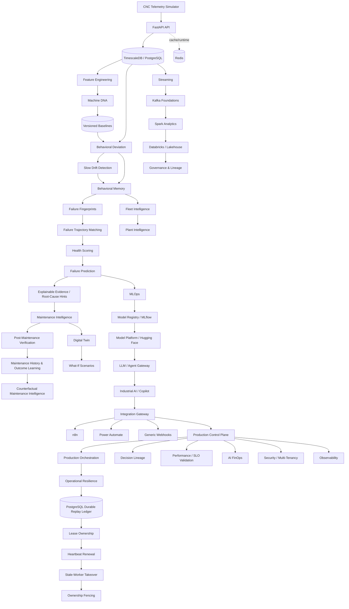

<div align="center">


[](https://github.com/saeidkh96/redpulse-ai/releases/tag/v3.8.0)
[](https://www.python.org/)
[](https://fastapi.tiangolo.com/)
[](https://www.postgresql.org/)
[](https://www.docker.com/)

</div>


---

## Overview

**RedPulse AI** is a production-oriented Behavioral Intelligence & Predictive Maintenance Platform. It learns how individual industrial machines normally behave, detects behavioral change and slow drift, estimates failure risk, supports maintenance decisions, verifies intervention outcomes, and reuses historical evidence across machines, fleets, and plants.

Instead of treating every machine as identical, RedPulse builds a **machine-specific behavioral fingerprint — Machine DNA** from multivariate telemetry. Versioned behavioral baselines provide the reference for deviation detection, drift analysis, behavioral memory, failure intelligence, health scoring, maintenance verification, and counterfactual analysis.

The architecture has expanded from machine-level predictive maintenance into streaming and large-scale analytics, MLOps, model-platform integration, Industrial AI, enterprise automation, multi-tenancy, production engineering, Digital Twin foundations, Databricks-oriented data-platform foundations, governance, and operational resilience.

> **Current release - v3.8.0: Platform Consolidation.** v3.8.0 consolidates RedPulse AI's production-readiness capabilities across failure engineering, event and outbox contracts, fleet intelligence, MLOps lifecycle controls, advanced failure intelligence, human-approved agentic maintenance, enterprise integrations, tenant authorization, SRE/SLO primitives, benchmarking, Kubernetes worker deployment contract, and explicit release-evidence validation.

> **Scope:** RedPulse AI is an experimental engineering/research project. It demonstrates architecture, runtime contracts, APIs, deployment paths, and validation foundations. It does not claim a live industrial deployment, safety certification, production identity-provider integration, a connected corporate Databricks workspace, or exactly-once execution of arbitrary external side effects.

---

## Why Machine DNA?

Traditional monitoring often asks whether a sensor crossed a fixed threshold. RedPulse asks:

> **Is this machine behaving differently from its own learned normal behavior?**

Machine DNA captures:

- sensor-level statistics;
- trends and slopes;
- relationships and correlations between signals;
- baseline metadata and versioning;
- machine-specific behavioral context.

This machine-specific baseline helps RedPulse distinguish behavioral change from simple global threshold violations.

---

## Current Release — v3.8.0
### v3.8.0 — Platform Consolidation

v3.8.0 consolidates the production-readiness expansion into one release line. It adds failure-engineering policies, outbox and idempotent event contracts, fleet-intelligence primitives, MLOps lifecycle controls, advanced failure estimation, human-approved agentic maintenance, enterprise integration contracts, tenant authorization, SRE/SLO primitives, reproducible benchmarking, Kubernetes worker deployment contract, and an explicit release-evidence gate while reusing the existing Kafka, Spark, Airflow, Kubernetes, Databricks, observability, security, and durable-runtime foundations.


### Runtime Resilience Validation

v3.7.1 validates and strengthens the runtime-resilience foundations introduced in v3.7.0:

- PostgreSQL-backed durable runtime replay state;
- tenant-aware durable execution claims;
- expiring worker leases;
- heartbeat-based lease renewal;
- atomic takeover of stale `RUNNING` executions;
- ownership-fenced state transitions;
- durable retry, success, and failure state;
- replay across runtime reconstruction;
- explicit recovery from persisted failed executions;
- concurrent-worker/idempotent replay validation;
- cross-tenant replay protection;
- stale-owner fencing after takeover.

The runtime provides **durable ownership, stale-worker recovery, and idempotent replay control**. It does not guarantee exactly-once execution of arbitrary external side effects after process failure. External operations should be idempotent or use downstream fencing/idempotency mechanisms where stronger guarantees are required.

### v3.7.0 — Operational Resilience & Autonomous Intelligence Expansion

v3.7.0 introduced:

- resilient stage execution with bounded retries and replay protection;
- deterministic idempotency-based duplicate prevention;
- tenant-isolation guards;
- operational decision lineage;
- throughput, p95 latency, error-rate and SLO evaluation;
- tenant-scoped AI FinOps and budget guardrails;
- human-approval boundaries for autonomous maintenance intents;
- evidence-gated fleet knowledge transfer;
- reuse of existing predictive-intelligence, retraining, champion/challenger, orchestration, security, and validation foundations;
- a consolidated platform-convergence validation gate.

The release intentionally reused existing RedPulse subsystems instead of introducing duplicate predictive, MLOps, orchestration, security, or operational-validation stacks.

---

## System Architecture



### Architectural Layers

| Layer | Responsibility |
|---|---|
| Telemetry | Machine telemetry ingestion and time-series persistence |
| Machine DNA | Machine-specific behavioral baselines and versioning |
| Behavioral intelligence | Deviation, slow drift, behavioral memory and context |
| Failure intelligence | Failure fingerprints, trajectory matching, health and prediction |
| Maintenance intelligence | Decisions, verification, outcome learning and counterfactual analysis |
| Fleet / plant | Cross-machine and plant-level intelligence |
| Streaming / analytics | Kafka-oriented streaming and Spark-oriented analytics foundations |
| Data platform | Databricks/Lakehouse, Medallion boundaries, governance and lineage |
| MLOps | Monitoring, retraining evaluation, registry and champion/challenger foundations |
| Model platform | Hugging Face integration, inference/embedding adapters and model gateway |
| Industrial AI | Evidence-grounded Copilot, knowledge and agent/tool foundations |
| Enterprise integration | n8n, Power Automate, webhooks and approval/workflow integration |
| Production engineering | Persistent runtime, idempotency, observability and deployment controls |
| Runtime resilience | Durable replay, leases, heartbeat, stale takeover and ownership fencing |
| Digital Twin | Machine-state representation and what-if predictive scenarios |
| Security | Tenant-aware authorization and isolation foundations |

---

## Predictive-Maintenance Intelligence Flow

```text
Telemetry
   ↓
Feature Engineering
   ↓
Machine DNA / Versioned Baseline
   ↓
Behavioral Deviation
   ↓
Slow Drift + Behavioral Memory
   ↓
Failure Fingerprints
   ↓
Trajectory Matching
   ↓
Health Scoring
   ↓
Failure Prediction
   ↓
Explainable Evidence / Root-Cause Hints
   ↓
Maintenance Decision
   ↓
Post-Maintenance Verification
   ↓
Maintenance History & Outcome Learning
   ↓
Counterfactual Maintenance Intelligence
```

RedPulse connects detection and prediction to maintenance evidence rather than stopping at anomaly detection.

---

## Runtime Resilience Architecture

The v3.7.1 resilience layer adds PostgreSQL-backed durable execution state to the existing runtime architecture.

A durable execution record stores:

- execution key;
- tenant, workflow and stage identity;
- execution state;
- attempt count;
- result/error data;
- lease owner;
- lease expiration;
- creation/update timestamps.

### Claim, Heartbeat and Takeover

A worker claims an execution using a unique lease owner and expiration time. While an operation is running, the worker renews the lease through a heartbeat.

If that worker disappears and the lease expires, another worker can atomically take over the stale `RUNNING` execution.

### Ownership Fencing

Database writes require the current `lease_owner`. After takeover, an old worker cannot overwrite the execution state. Successful and failed terminal states clear lease ownership.

### Replay Boundary

Completed executions can be replayed from durable state without rerunning the protected operation. Failed state is persisted and can be explicitly cleared for recovery.

The database protects runtime ownership and replay state. A process may still fail after an external side effect but before durable success is recorded, so arbitrary external effects require their own idempotency or fencing mechanism.

---

## Maintenance Intelligence

Capabilities include:

- maintenance intervention tracking;
- maintenance completion;
- post-maintenance verification;
- maintenance history;
- maintenance outcome learning;
- counterfactual maintenance intelligence;
- explainable evidence and root-cause hints.

Counterfactual maintenance is a decision-support capability. RedPulse does not autonomously execute physical maintenance.

---

## Fleet & Plant Intelligence

The architecture includes foundations for:

- fleet health and behavioral comparison;
- cross-machine learning;
- evidence-gated knowledge transfer;
- historical failure-pattern reuse;
- plant-level intelligence;
- machine-specific safeguards that avoid assuming all assets behave identically.

---

## Streaming & Large-Scale Analytics

Scale-oriented foundations include:

- Kafka-oriented telemetry/event streaming;
- Spark-oriented large-scale telemetry processing;
- feature engineering across larger histories;
- fleet analytics;
- historical failure analysis;
- Airflow-oriented scheduled data and ML orchestration.

These are architecture and validation foundations and do not by themselves imply a live high-throughput industrial deployment.

---

## MLOps & Model Platform

The MLOps/model-platform architecture includes foundations for:

- MLflow/model registry integration;
- model monitoring;
- retraining evaluation;
- candidate validation;
- champion/challenger decisions;
- controlled promotion;
- Hugging Face metadata/cache integration;
- embeddings and inference adapters;
- PEFT/LoRA;
- provider-independent model/LLM gateway concepts.

---

## Industrial AI & Enterprise Integration

Industrial AI foundations include structured knowledge ingestion, evidence-grounded Copilot capabilities, machine-context construction, an agentic runtime/tool registry, and maintenance-planning agent foundations.

Enterprise integration supports architectural contracts for:

- n8n;
- Microsoft Power Automate;
- generic JSON webhooks;
- notifications;
- tenant-aware integrations;
- approvals;
- retry/dead-letter patterns.

The RedPulse core remains independent of a single automation vendor.

---

## Production Engineering & Digital Twin

Production-oriented foundations include persistent runtime records, idempotency, tenant-aware authorization, environment-backed secret resolution, model routing, drift/retraining coordination, replay/data-quality/lineage controls, metrics, circuit-breaker primitives, Kubernetes manifests, and Azure/Terraform deployment scaffolding.

The Digital Twin layer provides machine-state representation, telemetry-driven updates, scenario simulation, projected health, projected drift, projected failure risk, and fleet-level twin aggregation.

These are engineering/reference foundations, not certified physical twins of real industrial assets.

---

## Databricks Lakehouse & Governance

```text
Machine / Platform Data
        ↓
Bronze
Raw / append-oriented ingestion
        ↓
Silver
Validated / normalized data
        ↓
Gold
Analytics / ML-ready data
        ↓
Governance + Lineage + Operational Validation
```

The repository contains Databricks-oriented Lakehouse/Medallion foundations, Auto Loader-oriented ingestion concepts, Asset Bundle structure, governance abstractions, lineage metadata, and access-control foundations.

A connected corporate Databricks workspace is not claimed.

---

## API Surface

The FastAPI application exposes endpoint groups across machine registry, telemetry, Machine DNA, deviation, drift, behavioral memory, failure intelligence, machine health, prediction/explanation, maintenance intelligence, fleet/plant intelligence, data-platform operations, MLOps/model-platform services, Industrial AI, enterprise automation, production controls, Digital Twin foundations, Databricks-oriented platform operations, and governance.

Representative maintenance endpoints:

```text
POST   /api/v1/machines/{machine_id}/maintenance-interventions
GET    /api/v1/machines/{machine_id}/maintenance-interventions
GET    /api/v1/maintenance-interventions/{intervention_id}
POST   /api/v1/maintenance-interventions/{intervention_id}/complete
GET    /api/v1/maintenance-outcomes
POST   /api/v1/machines/{machine_id}/counterfactual-maintenance
```

Use `/docs` on a running backend for the complete current OpenAPI surface.

---

## Technology Stack

| Area | Technologies / foundations |
|---|---|
| Backend | Python, FastAPI, Pydantic, SQLAlchemy, Alembic |
| Data | PostgreSQL 17, TimescaleDB, Redis |
| Analytics | Pandas, NumPy, scikit-learn |
| Streaming / scale | Kafka foundations, Spark analytics |
| Orchestration | Airflow foundations |
| MLOps / models | MLflow, Hugging Face integration, model gateway |
| Industrial AI | LLM/agent foundations, evidence-grounded Copilot, tool registry |
| Automation | n8n, Microsoft Power Automate, generic webhooks |
| Deployment | Docker Compose, Kubernetes manifests, Terraform/Azure scaffold |
| Observability | Prometheus/Grafana/OpenTelemetry-oriented foundations |
| Quality | pytest, migration validation, CI/release validation, Docker validation, CodeQL |

---

## Repository Structure

```text
redpulse-ai/
├── backend/
│   ├── alembic/
│   │   └── versions/
│   ├── app/
│   │   ├── api/
│   │   ├── core/
│   │   ├── models/
│   │   ├── repositories/
│   │   ├── services/
│   │   ├── maintenance/
│   │   ├── platform_expansion_v37/
│   │   │   ├── autonomy.py
│   │   │   ├── benchmarking.py
│   │   │   ├── durable_replay.py
│   │   │   ├── evidence.py
│   │   │   ├── finops.py
│   │   │   ├── release.py
│   │   │   ├── resilience.py
│   │   │   └── transfer.py
│   │   ├── runtime_v3/
│   │   ├── security_v3/
│   │   ├── streaming/
│   │   └── tenancy/
│   └── tests/
├── simulator/
│   └── tests/
├── analytics/
│   └── spark/
├── orchestration/
│   └── airflow/
├── databricks/
├── deployment/
├── docker-compose.yml
└── README.md
```

This is a high-level architecture map, not an exhaustive file listing.

---

## Local Development

### Requirements

- Python environment compatible with the repository
- Docker / Docker Compose
- PostgreSQL / TimescaleDB
- Redis

### Database migrations

From `backend`:

```powershell
python -m alembic upgrade head
python -m alembic current
```

Current v3.7.1 Alembic head:

```text
e371f044bd60
```

### API Documentation

With the development API running on the configured local port:

```text
http://127.0.0.1:8001/docs
```

---

## Testing

From the repository root:

```powershell
python -m pytest backend\tests simulator\tests -q
```

Validated on `main` for v3.7.1:

```text
281 passed, 1 warning
```

The remaining warning is the existing Starlette/httpx test-client deprecation warning and is unrelated to v3.7.1.

The dedicated v3.7.1 runtime-resilience integration test validates:

- durable replay across runner reconstruction;
- retry followed by persisted success;
- persisted failure and explicit recovery;
- concurrent workers executing the protected operation once;
- expired `RUNNING` lease takeover;
- heartbeat protection for a live long-running worker;
- stale-owner fencing after takeover.

The stale-worker scenario uses injected stale durable state to validate lease-expiration recovery. It does not claim an OS-level process-kill test.

---

## Release Timeline

```text
v0.x     Machine intelligence → failure intelligence → maintenance learning
  ↓
v1.0     Fleet, plant, streaming & large-scale data platform
  ↓
v1.2     Production MLOps
  ↓
v1.3     Hugging Face integration platform
  ↓
v1.4     Industrial Intelligence / Copilot foundations
  ↓
v1.6     Enterprise automation & multi-tenancy
  ↓
v2.0     Production platform foundation
  ↓
v2.1–2.9 Runtime, security, integrations, observability, model serving,
          data runtime, Copilot v2, Kubernetes, Azure/Terraform
  ↓
v3.0     Production demonstration platform
  ↓
v3.1     Production engineering + Digital Twin + advanced predictive intelligence
  ↓
v3.2     Databricks Lakehouse & enterprise data platform
  ↓
v3.3     Unified Data Governance
  ↓
v3.4     Databricks Production Deployment
  ↓
v3.5     Streaming & Scale Expansion
  ↓
v3.6     Production Platform Expansion
  ↓
v3.7     Operational Resilience & Autonomous Intelligence Expansion
  ↓
v3.7.1   Runtime Resilience Validation
  ↓
v3.8.0   Platform Consolidation  ← current
```

---

## Roadmap

| Version | Focus | Status |
|---|---|:---:|
| v3.2.0 | Databricks Lakehouse & Enterprise Data Platform | ✅ Completed |
| v3.3.0 | Unified Data Governance | ✅ Completed |
| v3.4.0 | Databricks Production Deployment | ✅ Completed |
| v3.5.0 | Streaming & Scale Expansion | ✅ Completed |
| v3.6.0 | Production Platform Expansion | ✅ Completed |
| v3.7.0 | Operational Resilience & Autonomous Intelligence Expansion | ✅ Completed |
| v3.7.1 | Runtime Resilience Validation — durable PostgreSQL replay, leases, heartbeat renewal, stale-worker recovery and ownership fencing | ✅ Completed |
| **v3.8.0** | **Platform Consolidation — failure engineering, event contracts, MLOps, advanced failure intelligence, agentic maintenance, integrations, security, SRE and benchmarking** | **✅ Current** |

### Next Phase — Real Deployment & Operational Validation

Priorities should increasingly validate the existing architecture under realistic conditions rather than add duplicate platform layers:

- production identity, authorization and secret-management integration;
- live external-integration environments;
- stronger observability and sustained SLO validation;
- OS/process-level crash and recovery testing;
- realistic concurrency/load resilience testing;
- Kubernetes/AKS deployment validation;
- reproducible cloud infrastructure;
- realistic industrial datasets and model validation;
- live Databricks workspace deployment/promotion validation;
- high-throughput Kafka/Spark scale validation.

---

## Engineering Boundaries

RedPulse AI distinguishes implemented engineering foundations from real-world production claims.

The repository does **not** claim:

- a live industrial deployment;
- safety certification;
- unattended physical maintenance execution;
- exactly-once arbitrary external side effects;
- a live corporate Databricks deployment;
- production identity-provider integration;
- validated industrial-scale throughput merely because scale-oriented architecture exists.

---

## Status

RedPulse AI is under active development and is currently an **experimental engineering/research project**, not a production safety system.

The current `v3.7.1` release strengthens the existing platform with PostgreSQL-backed durable runtime replay, lease-based execution ownership, heartbeat renewal, stale-worker recovery, ownership fencing, and validated concurrent replay behavior.

The next phase focuses on proving the broader platform in increasingly realistic operating conditions.

---

## Author

**Saeid Khalilian**
