<div align="center">


# RedPulse AI

### Behavioral Intelligence & Predictive Maintenance Platform

**Behavior. Insight. Uptime.**

</div>

[](https://github.com/saeidkh96/redpulse-ai/releases/tag/v0.2.0)
[](https://www.python.org/)
[](https://fastapi.tiangolo.com/)
[](https://www.timescale.com/)
[](https://www.postgresql.org/)
[](https://www.docker.com/)


------------------------------------------------------------------------

## What is RedPulse AI?

**RedPulse AI** is a production-oriented behavioral intelligence and
predictive-maintenance platform designed to learn how individual
industrial machines normally behave.

Instead of treating every machine as identical, RedPulse builds a
**machine-specific behavioral fingerprint --- Machine DNA** --- from
multivariate telemetry. That baseline captures sensor statistics,
trends, and relationships between signals so future behavior can be
compared against what is normal for that specific machine.

The long-term goal is to move beyond simple threshold monitoring toward
**early behavioral deviation detection, slow-drift analysis,
failure-trajectory matching, explainable maintenance evidence, and
post-maintenance verification**.

> **Current milestone --- v0.2.0:** RedPulse now combines versioned
> Machine DNA with behavioral deviation scoring, slow-drift detection,
> and persistent Behavioral Memory. Deviation and drift analyses are
> stored as machine-specific historical events with evidence, creating
> the foundation for cross-machine learning and failure-trajectory
> intelligence.

------------------------------------------------------------------------

## Why Machine DNA?

Traditional monitoring often asks:

> "Did a sensor cross a fixed threshold?"

RedPulse is being built to ask a richer question:

> **"Is this machine behaving differently from its own learned normal
> behavior?"**

Two machines of the same model may operate under different loads,
environments, ages, maintenance histories, and sensor characteristics. A
single global threshold can miss that context.

Machine DNA provides a per-machine baseline containing:

-   sensor distributions and operating ranges;
-   mean, median, standard deviation, minimum, and maximum;
-   temporal trend/slope information;
-   multivariate sensor correlations;
-   baseline observation window and sample count;
-   persistent, automatically versioned baseline history.

------------------------------------------------------------------------

## Current Architecture

``` mermaid
flowchart LR
    SIM[CNC Machine Simulator] -->|Telemetry batches| API[FastAPI API]
    API --> TS[(TimescaleDB)]
    API --> PG[(PostgreSQL)]
    API -. infrastructure .-> REDIS[(Redis)]

    TS --> FE[Feature Engine]
    FE --> STAT[Sensor Statistics]
    FE --> TREND[Trend / Slope]
    FE --> CORR[Correlation Engine]

    STAT --> DNA[Machine DNA Service]
    TREND --> DNA
    CORR --> DNA
    DNA --> BASE[(Versioned Machine Baselines)]

    TS --> DEV[Behavioral Deviation Engine]
    BASE --> DEV
    DEV --> DRIFT[Slow Drift Detection]
    DEV --> MEM[Behavioral Memory]
    DRIFT --> MEM
    MEM --> EVENTS[(Behavior Events)]

    EVENTS -. roadmap .-> CROSS[Cross-Machine Learning]
    CROSS -. roadmap .-> FAIL[Failure Fingerprint Library]
    FAIL -. roadmap .-> MATCH[Failure Trajectory Matching]
    MATCH -. roadmap .-> HEALTH[Early Warning / Health Score]
    HEALTH -. roadmap .-> EXPLAIN[Explainable Maintenance Evidence]
    EXPLAIN -. roadmap .-> VERIFY[Post-Maintenance Verification]
```



------------------------------------------------------------------------

## v0.2.0 Capabilities

  ------------------------------------------------------------------------
  Area                Capability                       Status
  ------------------- ------------------- --------------------------------
  Platform            FastAPI backend                    ✅
                      foundation          

  Infrastructure      PostgreSQL /                       ✅
                      TimescaleDB         

  Infrastructure      Redis service                      ✅

  Data model          Machine registry                   ✅

  Telemetry           Single and batch                   ✅
                      measurement         
                      ingestion           

  Telemetry           Machine / sensor /                 ✅
                      time-window queries 

  Telemetry           TimescaleDB                        ✅
                      hypertable          

  Simulation          Reproducible CNC                   ✅
                      telemetry generator 

  Simulation          RPM, load,                         ✅
                      temperature,        
                      current, vibration  

  Simulation          Normal, moderate,                  ✅
                      and severe          
                      degradation         
                      profiles            

  Features            Statistical sensor                 ✅
                      features            

  Features            Trend / slope                      ✅
                      extraction          

  Features            Cross-sensor                       ✅
                      correlation         
                      fingerprint         

  Machine DNA         Baseline generation                ✅
                      and persistence     

  Machine DNA         Automatic baseline                 ✅
                      versioning          

  Intelligence        Behavioral                         ✅
                      deviation scoring   

  Intelligence        Per-sensor                         ✅
                      deviation evidence  

  Intelligence        Correlation-shift                  ✅
                      detection           

  Intelligence        Severity                           ✅
                      classification      

  Intelligence        Multi-window                       ✅
                      slow-drift analysis 

  Intelligence        Trend, persistence,                ✅
                      monotonicity, and   
                      cumulative-change   
                      signals             

  Memory              Persistent                         ✅
                      behavioral event    
                      history             

  Memory              Deviation event                    ✅
                      recording           

  Memory              Drift event                        ✅
                      recording           

  Memory              Evidence-rich                      ✅
                      machine history API 

  Intelligence        Cross-machine                      🔜
                      learning            

  Intelligence        Failure fingerprint                🔜
                      library             

  Intelligence        Failure trajectory                 🔜
                      matching            

  Maintenance         Early warning /                    🔜
                      health scoring      

  Maintenance         Explainable                        🔜
                      evidence /          
                      root-cause hints    

  Maintenance         Post-maintenance                   🔜
                      verification        
  ------------------------------------------------------------------------

------------------------------------------------------------------------

## Machine DNA Example

A Machine DNA baseline is generated from synchronized telemetry and
persisted for later comparison.

``` json
{
  "baseline_version": "1",
  "sample_count": 1010,
  "sensor_features": {
    "vibration": {
      "mean": 2.1508,
      "std": 0.0832,
      "median": 2.149,
      "minimum": 1.875,
      "maximum": 2.382
    },
    "temperature": {
      "mean": 64.1570,
      "std": 1.2313
    }
  },
  "correlations": {
    "current__load": 0.8667,
    "load__temperature": 0.8225,
    "rpm__vibration": 0.3433
  }
}
```

The baseline is not just a collection of independent thresholds. The
correlations preserve part of the **relationship structure** between
machine signals.

------------------------------------------------------------------------

## CNC Telemetry Simulator

RedPulse includes a deterministic CNC simulator for development and
validation.

It currently generates five signals:

``` text
rpm
load
temperature
current
vibration
```

The signals are intentionally related. For example, load influences
temperature and current, while RPM contributes to vibration. Seeded
generation makes experiments reproducible. The simulator also supports
degradation profiles so deviation and drift behavior can be validated
against controlled moderate and severe deterioration scenarios.

A 1,000-snapshot validation run produced **5,000 measurements** and
demonstrated the expected baseline relationships before Machine DNA
generation.

------------------------------------------------------------------------

## Behavioral Intelligence Example

With degradation telemetry, RedPulse can distinguish healthy operation
from meaningful behavioral change.

A severe-degradation validation run produced an anomalous deviation
result with strong evidence in vibration, temperature, and current. The
drift engine then analyzed multiple consecutive windows and identified a
sustained `drifting` state.

Example behavioral-memory event:

``` json
{
  "event_type": "drift",
  "severity": "anomalous",
  "score": 0.60999,
  "baseline_version": "3",
  "summary": "Slow behavioral drift detected with score 0.610 and state drifting",
  "evidence": {
    "state": "drifting",
    "top_signals": [
      {
        "signal": "vibration__mean_zscore",
        "score": 0.86,
        "state": "drifting"
      },
      {
        "signal": "overall_deviation",
        "score": 0.72,
        "state": "drifting"
      },
      {
        "signal": "current__mean_zscore",
        "score": 0.66,
        "state": "drifting"
      }
    ]
  }
}
```

Behavioral Memory turns individual analyses into a persistent machine
history that later stages can use for failure-pattern learning,
trajectory matching, and maintenance verification.

------------------------------------------------------------------------

## Technology Stack

**Backend**

-   Python
-   FastAPI
-   Pydantic
-   SQLAlchemy
-   Alembic
-   asyncpg

**Data & Infrastructure**

-   PostgreSQL 17
-   TimescaleDB
-   Redis
-   Docker / Docker Compose

**Simulation & Analytics**

-   deterministic Python simulation
-   statistical feature extraction
-   trend analysis
-   Pearson correlation fingerprints

**Quality**

-   pytest
-   integration/API tests
-   migration validation
-   reproducible simulator tests

------------------------------------------------------------------------

## Repository Structure

``` text
redpulse-ai/
├── backend/
│   ├── alembic/
│   │   └── versions/
│   ├── app/
│   │   ├── api/v1/
│   │   ├── core/
│   │   ├── deviation/
│   │   ├── drift/
│   │   ├── features/
│   │   ├── memory/
│   │   ├── models/
│   │   ├── repositories/
│   │   ├── schemas/
│   │   └── services/
│   └── tests/
├── simulator/
│   ├── profiles/
│   └── tests/
├── docs/
│   └── images/
├── docker-compose.yml
├── .env.example
└── README.md
```

------------------------------------------------------------------------

## Quick Start

### 1. Clone the repository

``` bash
git clone https://github.com/saeidkh96/redpulse-ai.git
cd redpulse-ai
```

### 2. Create and activate a virtual environment

Windows PowerShell:

``` powershell
python -m venv .venv
.\.venv\Scripts\Activate.ps1
```

### 3. Install backend dependencies

``` powershell
pip install -r backend\requirements.txt
```

### 4. Start TimescaleDB and Redis

``` powershell
docker compose up -d
docker ps
```

The development infrastructure exposes:

``` text
TimescaleDB / PostgreSQL : localhost:5433
Redis                    : localhost:6379
```

### 5. Apply database migrations

``` powershell
cd backend
alembic upgrade head
```

### 6. Start the API

``` powershell
python -m uvicorn app.main:app --reload --port 8001
```

API root:

``` text
http://127.0.0.1:8001/
```

Interactive API documentation:

``` text
http://127.0.0.1:8001/docs
```

------------------------------------------------------------------------

## Core API Flow

The current platform supports an end-to-end behavioral-intelligence
workflow:

``` text
Register Machine
      ↓
Ingest / Simulate Telemetry
      ↓
Extract Behavioral Features
      ↓
Build Versioned Machine DNA
      ↓
Compare Current Behavior with Machine DNA
      ↓
Score Sensor Deviations + Correlation Shifts
      ↓
Analyze Multi-Window Slow Drift
      ↓
Persist Deviation / Drift Events
      ↓
Retrieve Behavioral Memory
```

Representative endpoints include:

``` text
POST   /api/v1/machines
GET    /api/v1/machines
GET    /api/v1/machines/{machine_id}
PATCH  /api/v1/machines/{machine_id}

POST   /api/v1/telemetry
POST   /api/v1/telemetry/batch
GET    /api/v1/telemetry/machines/{machine_id}

POST   /api/v1/machines/{machine_id}/dna/build
GET    /api/v1/machines/{machine_id}/dna

POST   /api/v1/machines/{machine_id}/deviation/analyze
POST   /api/v1/machines/{machine_id}/drift/analyze

GET    /api/v1/machines/{machine_id}/memory
```

------------------------------------------------------------------------

## Testing

Run the backend and simulator test suites from the repository root:

``` powershell
python -m pytest backend\tests simulator\tests -q
```

At the `v0.2.0` milestone:

``` text
63 passed
```

The suite covers platform health, infrastructure, machine registry,
telemetry ingestion, simulator behavior and degradation profiles,
feature extraction, Machine DNA generation and versioning, behavioral
deviation scoring, slow-drift detection, Behavioral Memory persistence,
API integration, and database-backed event history.

------------------------------------------------------------------------

## Milestones

``` text
v0.0.1  Platform Foundation
   ↓
v0.0.2  Data Infrastructure
   ↓
v0.0.3  Machine Registry
   ↓
v0.0.4  Telemetry Ingestion
   ↓
v0.0.5  CNC Simulator Baseline
   ↓
v0.1.0  Feature Engine + Machine DNA
   ↓
v0.1.1  Behavioral Deviation Engine
   ↓
v0.1.2  Slow Drift Detection
   ↓
v0.2.0  Behavioral Memory                 ← current
   ↓
         Cross-Machine Learning
   ↓
         Failure Fingerprint Library
   ↓
         Failure Trajectory Matching
   ↓
         Early Warning / Health Scoring
   ↓
         Explainable Maintenance Evidence
   ↓
         Post-Maintenance Verification
```

------------------------------------------------------------------------

## Vision

RedPulse AI is being developed around five ideas:

1.  **Every machine has its own normal.**\
    Learn machine-specific behavior instead of relying only on universal
    thresholds.

2.  **Relationships matter.**\
    A machine can change even when individual sensor values still look
    acceptable.

3.  **Failures have trajectories.**\
    Historical degradation patterns can become reusable failure
    fingerprints.

4.  **Predictions need evidence.**\
    Maintenance recommendations should show which signals, trends, and
    relationships changed.

5.  **Maintenance should be verifiable.**\
    After intervention, the platform should determine whether the
    machine actually returned toward healthy behavior.

------------------------------------------------------------------------

## Development Status

RedPulse AI is under active development and is currently an
**experimental engineering/research project**, not a production safety
system.

The `v0.2.0` release establishes the platform's first persistent
behavioral-intelligence loop:

**Machine DNA → Behavioral Deviation → Slow Drift Detection → Behavioral
Memory**

The system can now learn a machine-specific baseline, compare new
telemetry against that learned normal behavior, identify sustained
degradation across multiple windows, and preserve important findings as
structured historical events with supporting evidence.

The next major stage is **cross-machine learning and failure
intelligence**: learning reusable degradation patterns from multiple
machines, building a historical failure-fingerprint library, and
matching live behavior against known failure trajectories.

------------------------------------------------------------------------

<div align="center">

<strong>RedPulse AI</strong>

<em>Behavior. Insight. Uptime.</em>

</div>
