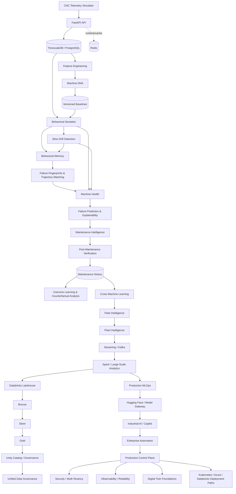

<div align="center">
  

# RedPulse AI
### Behavioral Intelligence & Predictive Maintenance Platform

**Behavior. Insight. Uptime.**
</div>

[](https://github.com/saeidkh96/redpulse-ai/releases/tag/v3.5.0)
[](https://www.python.org/)
[](https://fastapi.tiangolo.com/)
[](https://www.timescale.com/)
[](https://www.postgresql.org/)
[](https://www.docker.com/)

---

## Overview

**RedPulse AI** is a production-oriented behavioral intelligence and predictive-maintenance platform designed to learn how individual industrial machines normally behave, detect behavioral change, estimate failure risk, support maintenance decisions, verify intervention outcomes, and reuse historical evidence across machines, fleets, and plants.

Instead of treating every machine as identical, RedPulse builds a **machine-specific behavioral fingerprint — Machine DNA** from multivariate telemetry. Sensor statistics, trends, and relationships become a versioned baseline against which future behavior can be compared.

The platform has evolved from machine-level behavioral analytics into a broader industrial intelligence architecture that includes streaming, large-scale analytics, MLOps, model-platform integration, Industrial AI, enterprise automation, multi-tenancy, production engineering, Digital Twin foundations, and a Databricks-oriented enterprise data platform.

> **Current release — v3.5.0: Streaming & Scale Expansion.** This milestone strengthens the event-streaming and scale boundary with explicit Kafka topic contracts, machine-based partition keys, consumer-group definitions, publish retry and dead-letter routing, streaming metrics and health evaluation, deterministic fleet partitioning, micro-batch foundations, and Lakehouse handoff planning for Bronze → Silver → Gold processing.

> **Scope:** RedPulse AI is an experimental engineering/research project. The repository demonstrates architecture, runtime contracts, APIs, deployment paths, and validation foundations; it does not claim a live industrial deployment, safety certification, a connected corporate Databricks workspace, or production identity-provider integration.

---

## Why Machine DNA?

Traditional monitoring often asks whether a sensor crossed a fixed threshold. RedPulse asks a different question:

> **Is this machine behaving differently from its own learned normal behavior?**

Two machines of the same model can operate under different loads, environments, ages, maintenance histories, and sensor characteristics. A single global threshold can miss that context.

Machine DNA therefore captures:

- sensor-level statistics;
- trend and slope behavior;
- correlations between signals;
- baseline metadata and versioning;
- machine-specific behavioral context.

This baseline becomes the reference point for deviation detection, drift analysis, health scoring, failure intelligence, maintenance verification, and counterfactual analysis.

---

## Current Release — v3.5.0

### v3.2.0 — Databricks Lakehouse & Enterprise Data Platform

The v3.2.0 milestone introduced the enterprise data-platform boundary:

- Databricks-oriented Lakehouse architecture foundations;
- Bronze / Silver / Gold Medallion processing boundaries;
- Auto Loader-oriented ingestion foundations;
- Unity Catalog governance abstractions;
- Databricks Asset Bundle configuration;
- Bronze-to-Silver and Silver-to-Gold job entry points;
- GitHub Actions validation for Databricks bundle assets;
- a dedicated v3.2 roadmap API.

### v3.3.0 — Unified Data Governance

The v3.3.0 milestone deepened that foundation with:

- unified governance-policy models for enterprise data resources;
- catalog, schema, and table-level governance abstractions;
- access-control policy foundations;
- lineage-aware governance metadata;
- governance rules separated from the predictive-maintenance core;
- environment-aware Databricks deployment targets;
- dedicated governance validation integrated with the project test suite.

### v3.4.0 — Databricks Production Deployment

The current milestone moves the Databricks boundary toward controlled, production-oriented deployment:

- a dedicated production deployment service;
- explicit `dev`, `staging`, and `prod` deployment targets;
- environment-aware deployment configuration;
- deployment-readiness validation;
- Bronze-to-Silver and Silver-to-Gold job specifications;
- a v3.4 Databricks Asset Bundle configuration;
- dedicated GitHub Actions validation for the deployment layer;
- automated tests for deployment targets and readiness.

The deployment layer remains an engineering foundation. It does **not** claim a live corporate Databricks workspace or a completed production deployment.

---

### v3.5.0 — Streaming & Scale Expansion

The current milestone strengthens RedPulse AI's existing streaming and distributed-processing architecture:

- explicit Kafka contracts for telemetry, alert, and maintenance event streams;
- stable machine-based partition keys for per-machine event ordering;
- defined consumer groups for streaming workloads;
- bounded Kafka publish retries with dead-letter queue routing;
- streaming counters for publish, consume, failure, retry, and DLQ activity;
- consumer-lag state and streaming health evaluation;
- deterministic fleet partition planning and micro-batch processing foundations;
- Lakehouse handoff planning from Kafka-backed telemetry toward Bronze → Silver → Gold processing;
- continued use of the existing Spark analytics layer rather than a duplicate processing stack;
- dedicated v3.5 CI and regression validation.

The implementation remains infrastructure-independent at the intelligence layer: Kafka and Spark provide scalable transport and processing boundaries while Machine DNA, predictive intelligence, maintenance intelligence, and fleet analytics remain separate domain capabilities.

---

## Architecture



### Architectural principle

The behavioral and predictive-maintenance core remains independent from optional LLM, automation, MLOps, cloud, and Databricks vendors. External platforms are integrated through explicit adapters and platform boundaries rather than embedded into core machine intelligence.

---

## Core Capabilities

| Layer | Representative capabilities | Status |
|---|---|:---:|
| Machine intelligence | Machine DNA, deviation, slow drift, behavioral memory | ✅ |
| Failure intelligence | Failure fingerprints, trajectory matching, health scoring, prediction, explainability | ✅ |
| Maintenance intelligence | Recommendation, intervention tracking, verification, outcome learning, counterfactual analysis | ✅ |
| Fleet & plant | Cross-machine learning, similarity, fleet health, prioritization, plant risk/planning | ✅ |
| Streaming & analytics | Kafka topic contracts, machine partitioning, retry/DLQ handling, streaming health/metrics, real-time windows, Spark analytics, Lakehouse handoff | ✅ |
| MLOps | Experiment tracking, registry/lifecycle, monitoring, retraining, champion/challenger, MLflow/Airflow foundations | ✅ |
| Model platform | Hugging Face Hub metadata/cache, embeddings, inference, PEFT/LoRA, provider-independent gateway | ✅ |
| Industrial AI | Knowledge ingestion, evidence-grounded copilot, tool registry, maintenance-planning agent foundations | ✅ |
| Enterprise platform | Automation, n8n/Power Automate/webhooks, multi-tenancy, RBAC, approvals, production control plane | ✅ |
| Production engineering | Persistent runtime, idempotency, metrics, circuit breaker, CI/CD, CodeQL, deployment scaffolds | ✅ |
| Digital Twin | Machine-state representation, what-if scenarios, projected health/drift/failure risk | ✅ |
| Databricks platform | Lakehouse, Medallion boundaries, Auto Loader foundation, Asset Bundles | ✅ |
| Data governance | Unity Catalog abstractions, resource policies, lineage metadata, access-control foundations | ✅ |

---

## Predictive-Maintenance Intelligence Flow

```text
Telemetry
   ↓
Feature Engineering
   ↓
Machine DNA
   ↓
Behavioral Deviation + Slow Drift
   ↓
Behavioral Memory
   ↓
Failure Fingerprints + Trajectory Matching
   ↓
Machine Health
   ↓
Failure Prediction + Explainability
   ↓
Maintenance Decision
   ↓
Intervention Tracking
   ↓
Post-Maintenance Verification
   ↓
Outcome Learning
   ↓
Counterfactual Maintenance Intelligence
```

### Counterfactual maintenance

RedPulse compares the current machine condition with historically supported intervention outcomes to estimate how alternative actions may affect future risk. The goal is not to claim causal certainty, but to package evidence for better maintenance decisions.

### Post-maintenance verification

After an intervention, RedPulse compares current behavior with the pre-maintenance snapshot. Verification can consider health improvement, risk reduction, deviation reduction, drift reduction, and failure-match reduction. Results are persisted into maintenance history so intervention outcomes can become reusable evidence.

---

## Fleet, Plant & Streaming Intelligence

Machine-level evidence can be reused across similar assets through cross-machine learning and similarity analysis. This supports fleet health views, failure hotspots, maintenance prioritization, plant/site risk forecasting, and maintenance planning.

The streaming/data-platform layer provides explicit Kafka topic contracts, machine-based partitioning, consumer-group definitions, bounded publish retries, dead-letter routing, streaming health and metrics, real-time windows and intelligence events, deterministic fleet partitioning, micro-batch foundations, Spark analytics jobs, and Lakehouse handoff planning for larger telemetry workloads.

---

## Production MLOps & Model Platform

RedPulse includes foundations for:

- experiment tracking and model lifecycle management;
- feature-store contracts;
- data and model monitoring;
- automated retraining controls;
- champion/challenger evaluation;
- MLflow integration;
- Airflow retraining orchestration;
- Hugging Face Hub/model-card synchronization;
- local model caching;
- embeddings and inference adapters;
- PEFT/LoRA integration;
- provider-independent model routing.

Important production metrics include false-alert rate, precision/recall, early-warning lead time, drift behavior, and maintenance outcome quality.

---

## Industrial AI & Enterprise Integration

The Industrial AI layer provides structured knowledge ingestion, evidence-grounded copilot foundations, machine-context construction, an agentic runtime/tool registry, and maintenance-planning agent foundations.

The enterprise integration layer provides contracts and runtime foundations for:

- n8n webhook workflows;
- Microsoft Power Automate flow endpoints;
- generic JSON webhooks;
- notification routing;
- tenant-aware integrations;
- approvals, retries, and dead-letter foundations.

These adapters can perform real HTTP calls when valid endpoints and credentials are configured. The repository does not imply that live Microsoft 365, Teams, Outlook, Jira, CMMS, ERP, n8n, or Power Automate environments are currently connected.

---

## Production Engineering & Digital Twin

Production-oriented foundations include persistent runtime records, idempotency, tenant-aware authorization, environment-backed secret resolution, model routing, drift/retraining coordination, replay/data-quality/lineage controls, metrics, circuit-breaker primitives, Kubernetes manifests, and an Azure/Terraform deployment scaffold.

The Digital Twin layer provides machine-state representation, telemetry-driven state updates, scenario simulation, projected health, projected drift, projected failure risk, and fleet-level twin aggregation. These are engineering/reference foundations, not certified physical twins of real industrial assets.

---

## Databricks Lakehouse & Governance

```text
Operational / Streaming Data
          ↓
     Bronze Layer
          ↓
     Silver Layer
          ↓
      Gold Layer
          ↓
Enterprise Analytics / ML / Fleet Intelligence
          ↓
Unity Catalog & Unified Governance
```

The Databricks boundary is designed to support governed enterprise data workloads without coupling the machine-intelligence core to a single platform. Current repository foundations include Medallion processing boundaries, Auto Loader-oriented ingestion, Asset Bundle configuration, job entry points, governance abstractions, lineage-aware metadata, access-control policy foundations, environment-aware `dev` / `staging` / `prod` targets, deployment-readiness checks, and dedicated CI validation for the v3.4 deployment layer.

---

## Machine DNA Example

A Machine DNA baseline is generated from synchronized telemetry and
persisted for later comparison.

```json
{
  "baseline_version": "1",
  "sample_count": 1010,
  "sensor_features": {
    "vibration": {
      "mean": 2.1508,
      "std": 0.0832,
      "median": 2.149,
      "minimum": 1.875,
      "maximum": 2.382
    },
    "temperature": {
      "mean": 64.157,
      "std": 1.2313
    }
  },
  "correlations": {
    "current__load": 0.8667,
    "load__temperature": 0.8225,
    "rpm__vibration": 0.3433
  }
}
```

The baseline is not just a collection of independent thresholds. The
correlations preserve part of the **relationship structure** between
machine signals.

------------------------------------------------------------------------

## CNC Telemetry Simulator

RedPulse includes a deterministic CNC simulator for development and
validation.

It currently generates five signals:

```text
rpm
load
temperature
current
vibration
```

The signals are intentionally related. For example, load influences
temperature and current, while RPM contributes to vibration.

Seeded generation makes experiments reproducible. The simulator also
supports normal, moderate-degradation, and severe-degradation profiles
so the intelligence pipeline can be validated against controlled
deterioration scenarios.

------------------------------------------------------------------------

## Behavioral Intelligence Example

With degradation telemetry, RedPulse can distinguish healthy operation
from meaningful behavioral change.

A behavioral-memory event can preserve evidence such as:

```json
{
  "event_type": "drift",
  "severity": "anomalous",
  "score": 0.60999,
  "baseline_version": "3",
  "summary": "Slow behavioral drift detected with score 0.610 and state drifting",
  "evidence": {
    "state": "drifting",
    "top_signals": [
      {
        "signal": "vibration__mean_zscore",
        "score": 0.86,
        "state": "drifting"
      },
      {
        "signal": "overall_deviation",
        "score": 0.72,
        "state": "drifting"
      },
      {
        "signal": "current__mean_zscore",
        "score": 0.66,
        "state": "drifting"
      }
    ]
  }
}
```

Behavioral Memory converts individual analyses into structured
historical evidence used by failure intelligence and maintenance
reasoning.

------------------------------------------------------------------------

## Technology Stack

| Area | Technologies / foundations |
|---|---|
| Backend | Python 3.12, FastAPI, Pydantic, SQLAlchemy, Alembic, asyncpg |
| Operational data | PostgreSQL 17, TimescaleDB, Redis |
| Streaming & scale | Apache Kafka, Apache Spark, Apache Airflow |
| Enterprise data | Databricks Lakehouse, Medallion Architecture, Auto Loader foundation, Unity Catalog governance foundation, Asset Bundles |
| MLOps / models | MLflow adapter, Hugging Face integration, embeddings/inference adapters, PEFT/LoRA, model gateway |
| Automation | n8n, Microsoft Power Automate, generic webhooks |
| Deployment | Docker Compose, Kubernetes manifests, Terraform Azure scaffold |
| Quality | pytest, migration validation, CI/release validation, Docker build validation, CodeQL |

---

## Repository Structure

```text
redpulse-ai/
├── backend/
│   ├── alembic/
│   ├── app/
│   │   ├── api/v1/
│   │   ├── agents/
│   │   ├── automation/
│   │   ├── copilot/
│   │   ├── data_platform/
│   │   ├── deviation/
│   │   ├── drift/
│   │   ├── enterprise/
│   │   ├── failure/
│   │   ├── features/
│   │   ├── fleet/
│   │   ├── governance_v33/
│   │   ├── databricks_deploy_v34/
│   │   ├── health/
│   │   ├── integrations/
│   │   ├── maintenance/
│   │   ├── memory/
│   │   ├── mlops/
│   │   ├── plant/
│   │   ├── prediction/
│   │   ├── production/
│   │   ├── runtime_v3/
│   │   ├── security_v3/
│   │   ├── streaming/
│   │   └── tenancy/
│   └── tests/
├── analytics/spark/
├── orchestration/airflow/dags/
├── databricks/
│   ├── databricks.yml
│   ├── databricks_v34.yml
│   ├── targets.yml
│   └── jobs/
├── infra/
│   ├── k8s/
│   └── terraform/azure/
├── simulator/
├── docs/images/
├── docker-compose.yml
├── docker-compose.streaming.yml
└── README.md
```

> The tree is intentionally summarized to show the major architectural boundaries rather than every implementation file.

---

## Quick Start

### 1. Clone the repository

```bash
git clone https://github.com/saeidkh96/redpulse-ai.git
cd redpulse-ai
```

### 2. Create and activate a virtual environment

Windows PowerShell:

```powershell
python -m venv .venv
.\.venv\Scripts\Activate.ps1
```

### 3. Install backend dependencies

```powershell
pip install -r backend\requirements.txt
```

### 4. Start TimescaleDB and Redis

```powershell
docker compose up -d
docker ps
```

Development infrastructure:

```text
TimescaleDB / PostgreSQL : localhost:5433
Redis                    : localhost:6379
```

### 5. Apply database migrations

```powershell
cd backend
alembic upgrade head
```

### 6. Start the API

```powershell
python -m uvicorn app.main:app --reload --port 8001
```

API root:

```text
http://127.0.0.1:8001/
```

Interactive API documentation:

```text
http://127.0.0.1:8001/docs
```

------------------------------------------------------------------------

## API Surface

The FastAPI application exposes endpoint groups for machine registry, telemetry, Machine DNA, deviation, drift, behavioral memory, failure intelligence, machine health, failure prediction/explanation, maintenance intelligence, fleet/plant intelligence, data-platform operations, MLOps/model-platform services, Industrial AI, enterprise automation, production controls, Digital Twin foundations, Databricks roadmap/platform operations, and governance.

Representative maintenance endpoints:

```text
POST   /api/v1/machines/{machine_id}/maintenance-interventions
GET    /api/v1/machines/{machine_id}/maintenance-interventions
GET    /api/v1/maintenance-interventions/{intervention_id}
POST   /api/v1/maintenance-interventions/{intervention_id}/complete
GET    /api/v1/maintenance-outcomes
POST   /api/v1/machines/{machine_id}/counterfactual-maintenance
```

Use `/docs` for the complete current OpenAPI surface.

---

## Testing

Run the backend and simulator suites from the repository root:

```powershell
python -m pytest backend\tests simulator\tests -q
```

At the **v3.5.0** milestone:

```text
259 passed
```

Validation covers the machine-intelligence pipeline, maintenance intelligence, fleet/plant services, model-platform and Industrial AI foundations, enterprise automation, production runtime/control-plane components, Databricks assets, governance and deployment foundations, service behavior, API/OpenAPI integration, migrations, simulator behavior, CI/CD, Docker validation, and security scanning.

---

## Release Timeline

```text
v0.x    Machine intelligence → failure intelligence → maintenance learning
  ↓
v1.0    Fleet, plant, streaming & large-scale data platform
  ↓
v1.2    Production MLOps
  ↓
v1.3    Hugging Face integration platform
  ↓
v1.4    Industrial Intelligence / Copilot foundations
  ↓
v1.6    Enterprise automation & multi-tenancy
  ↓
v2.0    Production platform foundation
  ↓
v2.1–2.9
        Runtime, security, integrations, observability, model serving,
        data runtime, Copilot v2, Kubernetes, Azure/Terraform
  ↓
v3.0    Production demonstration platform
  ↓
v3.1    Production engineering + Digital Twin + advanced predictive intelligence
  ↓
v3.2    Databricks Lakehouse & enterprise data platform
  ↓
v3.3    Unified Data Governance
  ↓
v3.4    Databricks Production Deployment
  ↓
v3.5    Streaming & Scale Expansion  ← current
```

For detailed historical release contents, use the repository release history and tags.

---

## Roadmap

| Version | Focus | Status |
|---|---|:---:|
| v3.2.0 | Databricks Lakehouse & Enterprise Data Platform | ✅ Completed |
| v3.3.0 | Unified Data Governance | ✅ Completed |
| v3.4.0 | Databricks Production Deployment | ✅ Completed |
| **v3.5.0** | **Streaming & Scale Expansion** | **✅ Current** |
| v3.6.0 | Production Orchestration | Planned |
| v3.7.0 | Advanced MLOps | Planned |
| v3.8.0 | Enterprise Integration Expansion | Planned |
| v3.9.0 | Platform Hardening | Planned |
| v4.0.0 | Operational Validation Platform | Planned |

### Next phase: real deployment & operational validation

Future work should increasingly validate the existing architecture in realistic environments rather than only adding new modules. Priority areas include:

- durable database-backed runtime state;
- production identity, authorization, and secret management;
- live external-integration environments;
- stronger observability, SLOs, and failure recovery;
- load, recovery, and resilience testing;
- Kubernetes/AKS deployment validation;
- reproducible cloud infrastructure;
- realistic industrial datasets and model validation;
- live Databricks workspace deployment/promotion validation;
- high-throughput Kafka/Spark streaming and scale validation.

---

## Engineering Principles

1. **Every machine has its own normal.** Learn machine-specific behavior rather than relying only on universal thresholds.
2. **Relationships matter.** Behavioral change can appear in relationships between signals before individual values look abnormal.
3. **Failures have trajectories.** Historical degradation patterns can become reusable evidence.
4. **Predictions need evidence.** Risk and maintenance recommendations should expose the signals and patterns behind them.
5. **Maintenance should be verifiable.** An intervention is not successful merely because it was completed.
6. **Maintenance history should become reusable knowledge.** Outcomes should improve future decisions.
7. **Decisions should consider alternatives.** Counterfactual analysis should compare historically supported options without pretending to establish causal certainty.
8. **Core intelligence stays vendor-independent.** Automation, LLM, MLOps, cloud, and data-platform integrations remain behind explicit boundaries.

---

## Development Status

RedPulse AI is under active development and is currently an **experimental engineering/research project**, not a production safety system.

The current `v3.5.0` release combines the existing behavioral/predictive-maintenance core with fleet and plant intelligence, a strengthened Kafka streaming boundary, retry and dead-letter handling, streaming health and metrics, deterministic partitioning and micro-batch foundations, Spark-based distributed analytics, Lakehouse handoff planning, MLOps/model-platform foundations, Industrial AI, enterprise automation, production runtime and deployment scaffolds, Digital Twin foundations, and the Databricks-oriented enterprise data platform.

The next milestone is **v3.6.0 — Production Orchestration**. The broader objective through v4.0.0 is to move from architectural breadth toward deeper deployment, resilience, security, observability, scale, orchestration, MLOps, enterprise integration, and operational validation.

---

## Author

**Saeid Khalilian**

---

## License

See the repository license for usage terms.

<div align="center">
  <strong>RedPulse AI</strong><br/>
  <em>Behavior. Insight. Uptime.</em>
</div>
