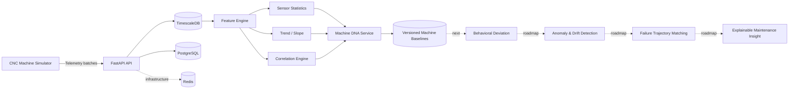

<div align="center">


# RedPulse AI

### Behavioral Intelligence & Predictive Maintenance Platform

**Behavior. Insight. Uptime.**

[](https://github.com/saeidkh96/redpulse-ai/releases/tag/v0.1.0)
[](https://www.python.org/)
[](https://fastapi.tiangolo.com/)
[](https://www.timescale.com/)
[](https://www.postgresql.org/)
[](https://www.docker.com/)

</div>

---

## What is RedPulse AI?

**RedPulse AI** is a production-oriented behavioral intelligence and predictive-maintenance platform designed to learn how individual industrial machines normally behave.

Instead of treating every machine as identical, RedPulse builds a **machine-specific behavioral fingerprint — Machine DNA** — from multivariate telemetry. That baseline captures sensor statistics, trends, and relationships between signals so future behavior can be compared against what is normal for that specific machine.

The long-term goal is to move beyond simple threshold monitoring toward **early behavioral deviation detection, slow-drift analysis, failure-trajectory matching, explainable maintenance evidence, and post-maintenance verification**.

> **Current milestone — v0.1.0:** telemetry infrastructure, realistic CNC simulation, feature extraction, and versioned Machine DNA are implemented. Behavioral deviation and predictive-maintenance intelligence are the next development stages.

---

## Why Machine DNA?

Traditional monitoring often asks:

> “Did a sensor cross a fixed threshold?”

RedPulse is being built to ask a richer question:

> **“Is this machine behaving differently from its own learned normal behavior?”**

Two machines of the same model may operate under different loads, environments, ages, maintenance histories, and sensor characteristics. A single global threshold can miss that context.

Machine DNA provides a per-machine baseline containing:

- sensor distributions and operating ranges;
- mean, median, standard deviation, minimum, and maximum;
- temporal trend/slope information;
- multivariate sensor correlations;
- baseline observation window and sample count;
- persistent, automatically versioned baseline history.

---

## Current Architecture



---

## v0.1.0 Capabilities

| Area | Capability | Status |
|---|---|:---:|
| Platform | FastAPI backend foundation | ✅ |
| Infrastructure | PostgreSQL / TimescaleDB | ✅ |
| Infrastructure | Redis service | ✅ |
| Data model | Machine registry | ✅ |
| Telemetry | Single measurement ingestion | ✅ |
| Telemetry | Batch ingestion | ✅ |
| Telemetry | Machine / sensor / time-window queries | ✅ |
| Telemetry | TimescaleDB hypertable | ✅ |
| Simulation | Reproducible CNC telemetry generator | ✅ |
| Simulation | RPM, load, temperature, current, vibration | ✅ |
| Simulation | Correlated realistic baseline signals | ✅ |
| Features | Statistical sensor features | ✅ |
| Features | Trend / slope extraction | ✅ |
| Features | Cross-sensor correlation fingerprint | ✅ |
| Machine DNA | Baseline generation | ✅ |
| Machine DNA | Persistence and retrieval | ✅ |
| Machine DNA | Automatic baseline versioning | ✅ |
| Machine DNA | DB-level version uniqueness | ✅ |
| Intelligence | Behavioral deviation scoring | 🔜 |
| Intelligence | Anomaly & slow-drift detection | 🔜 |
| Intelligence | Failure trajectory matching | 🔜 |
| Maintenance | Explainable evidence / root-cause hints | 🔜 |
| Maintenance | Post-maintenance verification | 🔜 |

---

## Machine DNA Example

A Machine DNA baseline is generated from synchronized telemetry and persisted for later comparison.

```json
{
  "baseline_version": "1",
  "sample_count": 1010,
  "sensor_features": {
    "vibration": {
      "mean": 2.1508,
      "std": 0.0832,
      "median": 2.149,
      "minimum": 1.875,
      "maximum": 2.382
    },
    "temperature": {
      "mean": 64.1570,
      "std": 1.2313
    }
  },
  "correlations": {
    "current__load": 0.8667,
    "load__temperature": 0.8225,
    "rpm__vibration": 0.3433
  }
}
```

The baseline is not just a collection of independent thresholds. The correlations preserve part of the **relationship structure** between machine signals.

---

## CNC Telemetry Simulator

RedPulse includes a deterministic CNC simulator for development and validation.

It currently generates five signals:

```text
rpm
load
temperature
current
vibration
```

The signals are intentionally related. For example, load influences temperature and current, while RPM contributes to vibration. Seeded generation makes experiments reproducible.

A 1,000-snapshot validation run produced **5,000 measurements** and demonstrated the expected baseline relationships before Machine DNA generation.

---

## Technology Stack

**Backend**

- Python
- FastAPI
- Pydantic
- SQLAlchemy
- Alembic
- asyncpg

**Data & Infrastructure**

- PostgreSQL 17
- TimescaleDB
- Redis
- Docker / Docker Compose

**Simulation & Analytics**

- deterministic Python simulation
- statistical feature extraction
- trend analysis
- Pearson correlation fingerprints

**Quality**

- pytest
- integration/API tests
- migration validation
- reproducible simulator tests

---

## Repository Structure

```text
redpulse-ai/
├── backend/
│   ├── alembic/
│   │   └── versions/
│   ├── app/
│   │   ├── api/v1/
│   │   ├── core/
│   │   ├── features/
│   │   ├── models/
│   │   ├── repositories/
│   │   ├── schemas/
│   │   └── services/
│   └── tests/
├── simulator/
│   ├── profiles/
│   └── tests/
├── docs/
│   └── images/
├── docker-compose.yml
├── .env.example
└── README.md
```

---

## Quick Start

### 1. Clone the repository

```bash
git clone https://github.com/saeidkh96/redpulse-ai.git
cd redpulse-ai
```

### 2. Create and activate a virtual environment

Windows PowerShell:

```powershell
python -m venv .venv
.\.venv\Scripts\Activate.ps1
```

### 3. Install backend dependencies

```powershell
pip install -r backend\requirements.txt
```

### 4. Start TimescaleDB and Redis

```powershell
docker compose up -d
docker ps
```

The development infrastructure exposes:

```text
TimescaleDB / PostgreSQL : localhost:5433
Redis                    : localhost:6379
```

### 5. Apply database migrations

```powershell
cd backend
alembic upgrade head
```

### 6. Start the API

```powershell
python -m uvicorn app.main:app --reload --port 8001
```

API root:

```text
http://127.0.0.1:8001/
```

Interactive API documentation:

```text
http://127.0.0.1:8001/docs
```

---

## Core API Flow

The current platform supports the following workflow:

```text
Register Machine
      ↓
Ingest Telemetry
      ↓
Query Time-Series Data
      ↓
Extract Behavioral Features
      ↓
Build Machine DNA
      ↓
Persist Versioned Baseline
      ↓
Retrieve Latest Machine DNA
```

Representative endpoints include:

```text
POST   /api/v1/machines
GET    /api/v1/machines
GET    /api/v1/machines/{machine_id}
PATCH  /api/v1/machines/{machine_id}

POST   /api/v1/telemetry
POST   /api/v1/telemetry/batch
GET    /api/v1/telemetry/machines/{machine_id}

POST   /api/v1/machines/{machine_id}/dna/build
GET    /api/v1/machines/{machine_id}/dna
```

---

## Testing

Run the backend and simulator test suites from the repository root:

```powershell
python -m pytest backend\tests simulator\tests -q
```

At the `v0.1.0` milestone:

```text
20 passed
```

The suite covers platform health, infrastructure, machine registry, telemetry ingestion, simulator behavior, feature extraction, Machine DNA generation, retrieval, and baseline versioning.

---

## Milestones

```text
v0.0.1  Platform Foundation
   ↓
v0.0.2  Data Infrastructure
   ↓
v0.0.3  Machine Registry
   ↓
v0.0.4  Telemetry Ingestion
   ↓
v0.0.5  CNC Simulator Baseline
   ↓
v0.1.0  Feature Engine + Machine DNA   ← current
   ↓
         Behavioral Deviation
   ↓
         Multivariate Anomaly Detection
   ↓
         Slow Drift Detection
   ↓
         Behavioral Memory
   ↓
         Cross-Machine Learning
   ↓
         Failure Fingerprint Library
   ↓
         Failure Trajectory Matching
   ↓
         Early Warning / Health Scoring
   ↓
         Explainable Maintenance Evidence
   ↓
         Post-Maintenance Verification
```

---

## Vision

RedPulse AI is being developed around five ideas:

1. **Every machine has its own normal.**  
   Learn machine-specific behavior instead of relying only on universal thresholds.

2. **Relationships matter.**  
   A machine can change even when individual sensor values still look acceptable.

3. **Failures have trajectories.**  
   Historical degradation patterns can become reusable failure fingerprints.

4. **Predictions need evidence.**  
   Maintenance recommendations should show which signals, trends, and relationships changed.

5. **Maintenance should be verifiable.**  
   After intervention, the platform should determine whether the machine actually returned toward healthy behavior.

---

## Development Status

RedPulse AI is under active development and is currently an **experimental engineering/research project**, not a production safety system.

The `v0.1.0` release establishes the first behavioral-intelligence foundation: **Machine DNA**.

The next milestone introduces comparison between current machine behavior and its learned baseline, creating the basis for anomaly and drift intelligence.

---

## Author

**Saeid Khalilian**

---

<div align="center">

**RedPulse AI**

*Behavior. Insight. Uptime.*

</div>
